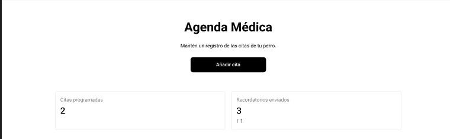
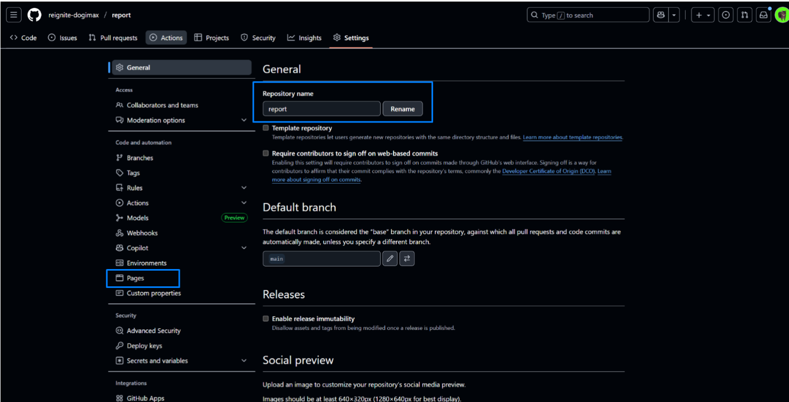

Universidad Peruana de Ciencias Aplicadas 

Ingeniería de Software

Ciclo: 05

Aplicaciones Open Source

Sección: 4350

Docente: Ivan Robles Fernández

Integrantes: 
 * Brayan Roberto Ccarita Cruz
 * Bryan Félix Martínez Ramos
 * Juan David Saldaña De Souza
 * Joseph Manuel Chavez Viera
 * Dueñas Canales Leonardo Manuel

TB1

Startup: Reignite - Dogimax

Septiembre 2025

# Registro de versiones

| Versión | Fecha      | Autor                                                        | Descripción de modificación                                  |
| ------- | ---------- | ------------------------------------------------------------ | ------------------------------------------------------------ |
| 0.0.1   | 09/09/2025 | Bryan Martinez                                                | Iniciando el proyecto luego de las divisiones de trabajo, dividimos la primera parte del proyecto que incluyen los primeros 2 puntos del proyecto final, tanto la idea principal del proyecto, nuestras misiones, visiones, nuestros objetivos, plantear los diferentes problemas y como nuestor proyecto lo soluciona, tambien la creacion del segmento objetivo, entender cuales son sus sentimientos y como nuestro proyecto cambia e influye en su vida, realizamos las entrevistas y completamos esta etapa satisfactoriamente para comenzar a realizar la elaboracion de los puntos 3 y 4.

# Project Report Collaboration Insights

Url de la organización:https://github.com/reignite-dogimax

____________ fue el encargado de crear las, todos los integrantes colaboraron y se deja las evidencias en las imagenes

TB1: Desarrollo de la landing page de dogimax

Nuestra TB1 se enfoco en establecer las base documentales y los diseños, nos hemos enfocado en el sentimiento principal que generara en el usuario.

Se documento los temas de la problematica, los segmentos objetivos, LeanUX, investigacion mas profunda sobre el mercado posible que podemos abarcar y sus competidores 

Tambien la estructura del proyecto, los diagramas de flujos,contenedores y componentes para asi tener una buena base para posteriormente implementarlo.

*
*
*

**Contribuciones por Integrante**

La contribuccion de cada integrante es la siguiente:

**Bryan Felix Martinez Ramos:**

- **Descripcion de la Startup** Se definio la base del proyecto, cual es nuestro enfoque, mision y vision
- **Perfiles de integrantes del equipo** Se Organizo la informacion de los miembros del grupo
- **Antecedentes y problemática** Se investigo nuestro publico objetivo como a avanzado estos ultimos años y usamos los What,When,Where,Who,How y How much para comprenderlos mejor
- **Lean UX Problem Statements** Se identifico el problema central de los dueños y se definio como nuestro negocio apoyara a los usuarios
- **Lean UX Assumptions** Se establecio los puntos claves del negocio y los beneficios para el usuario en torno a nuestra plataforma,tambien analizamos demanda del mercado, sostenibilidad y la integracion de aliados estrategicos.

- **Lean UX Hypothesis Statements** Se formularon hipótesis clave sobre el impacto de la plataforma en la organización del cuidado, la adopción de recomendaciones personalizadas y la interacción con productos y servicios confiables, estableciendo métricas de éxito basadas en uso, satisfacción y resultados en el bienestar de las mascotas.

- **Lean UX Canvas** Definimos el problema de negocio, usuarios clave, hipótesis, ideas de solución y aprendizajes prioritarios. Además, se establecieron los outcomes esperados, beneficios para los usuarios y próximos pasos de validación mediante encuestas y entrevistas.

**Brayan Roberto Ccarita Cruz**

**Juan David Saldaña De Souza**

**Joseph Manuel Chavez Viera**

**Dueñas Canales Leonardo Manuel**

[Registro de versiones](#registro-de-versiones)

[Project Report Collaboration Insights](#project-report-collaboration-insights)

[Student Outcome](#student-outcome)

[1. Introducción](#1-capítulo-i-introducción)

[1.1. Startup Profile](#11-startup-profile)

[1.1.1. Descripción de la Startup](#111-descripción-de-la-startup)

[1.1.2. Perfiles de integrantes del equipo](#112-perfiles-de-integrantes-del-equipo)

[1.2. Solution Profile](#12-solution-profile)

[1.2.1. Antecedentes y problemática](#121-antecedentes-y-problemática)

[1.2.2. Lean UX Process](#122-lean-ux-process)

[1.2.2.1. Lean UX Problem Statement](#1221-lean-ux-problem-statement)

[1.2.2.2. Lean UX Assumptions](#1222-lean-ux-assumptions)

[1.2.2.3. Lean UX Hypothesis Statements](#1223-lean-ux-hypothesis-statements)

[1.2.2.4. Lean UX Canvas](#1224-lean-ux-canvas)

[1.3. Segmentos objetivo](#13-segmentos-objetivo)

[2. Capítulo II: Requirements Elicitation & Analysis](#2-capítulo-ii-requirements-elicitation--analysis)

[2.1. Competidores](#21-competidores)

[2.1.1. Análisis competitivo](#211-análisis-competitivo)

[2.1.2. Estrategias y tácticas frente a competidores](#212-estrategias-y-tácticas-frente-a-competidores)

[2.2. Entrevistas](#22-entrevistas)

[2.2.1. Diseño de Entrevistas](#221-diseño-de-entrevistas)

[2.2.2. Registro de entrevistas](#222-registro-de-entrevistas)

[2.2.3. Análisis de entrevistas](#223-análisis-de-entrevistas)

[2.3. Needfinding](#23-needfinding)

[2.3.1. User Personas](#231-user-personas)

[2.3.2. User Task Matrix](#232-user-task-matrix)

[2.3.3. User Journey Mapping](#233-user-journey-mapping)

[2.3.4. Empathy Mapping](#234-empathy-mapping)

[2.3.5. As-is Scenario Mapping](#235-as-is-scenario-mapping)

[2.4. Ubiquitous Language](#24-ubiquitous-language)

[3. Capítulo III: Requirements Specification](#3-capítulo-iii-requirements-specification)

[3.1. To-Be Scenario Mapping](#31-to-be-scenario-mapping)

[3.2. User Stories](#32-user-stories)

[3.3. Impact Mapping](#33-impact-mapping)

[3.4. Product Backlog](#34-product-backlog)

[4. Capítulo IV: Product Design](#4-capítulo-iv-product-design)

[4.1. Style Guidelines](#41-style-guidelines)

[4.1.1. General Style Guidelines](#411-general-style-guidelines)

[4.1.2. Web Style Guidelines](#412-web-style-guidelines)

[4.2. Information Architecture](#42-information-architecture)

[4.2.1. Organization Systems](#421-organization-systems)

[4.2.2. Labeling Systems](#422-labeling-systems)

[4.2.3. SEO Tags and Meta Tags](#423-seo-tags-and-meta-tags)

[4.2.4. Searching Systems](#424-searching-systems)

[4.2.5. Navigation Systems](#425-navigation-systems)

[4.3. Landing Page UI Design](#43-landing-page-ui-design)

[4.3.1. Landing Page Wireframe](#431-landing-page-wireframe)

[4.3.2. Landing Page Mock-up](#432-landing-page-mock-up)

[4.4. Web Applications UX/UI Design](#44-web-applications-uxui-design)

[4.4.1. Web Applications Wireframes](#441-web-applications-wireframes)

[4.4.2. Web Applications Wireflow Diagrams](#442-web-applications-wireflow-diagrams)

[4.4.3. Web Applications Mock-ups](#443-web-applications-mock-ups)

[4.4.4. Web Applications User Flow Diagrams](#444-web-applications-user-flow-diagrams)

[4.5. Web Applications Prototyping](#45-web-applications-prototyping)

[4.6. Domain-Driven Software Architecture](#46-domain-driven-software-architecture)

[4.6.1. Software Architecture Context Diagram](#461-software-architecture-context-diagram)

[4.6.2. Software Architecture Container Diagram](#462-software-architecture-container-diagram)

[4.6.3. Software Architecture Componentes Diagrams](#463-software-architecture-componentes-diagrams)

[4.7. Software Object-Oriented Design](#47-software-object-oriented-design)

[4.7.1. Class Diagrams](#471-class-diagrams)

[4.7.2. Class Dictionary](#472-class-dictionary)

[4.8. Database Design](#48-database-design)

[4.8.1. Database Diagram](#481-database-diagram)

[5. Capítulo V: Product Implementation, Validation & Deployment](#5-capítulo-v-product-implementation-validation--deployment)

[5.1. Software Configuration Management](#51-software-configuration-management)

[5.1.1. Software Development Environment Configuration](#511-software-development-environment-configuration)

[5.1.2. Source Code Management](#512-source-code-management)

[5.1.3. Source Code Style Guide & Conventions](#513-source-code-style-guide--conventions)

[5.1.4. Software Deployment Configuration](#514-software-deployment-configuration)

[5.2. Landing Page, Services & Applications Implementation](#52-landing-page-services--applications-implementation)

[5.2.1. Sprint 1](#521-sprint-1)

[5.2.1.1. Sprint Planning 1](#5211-sprint-planning-1)

[5.2.1.2. Aspect Leaders and Collaborators](#5212-aspect-leaders-and-collaborators)

[5.2.1.3. Sprint Backlog 1](#5213-sprint-backlog-1)

[5.2.1.4. Development Evidence for Sprint Review](#5214-development-evidence-for-sprint-review)

[5.2.1.5. Execution Evidence for Sprint Review](#5215-execution-evidence-for-sprint-review)

[5.2.1.6. Services Documentation Evidence for Sprint Review](#5216-services-documentation-evidence-for-sprint-review)

[5.2.1.7. Software Deployment Evidence for Sprint Review](#5217-software-deployment-evidence-for-sprint-review)

[5.2.1.8. Team Collaboration Insights during Sprint](#5218-team-collaboration-insights-during-sprint)

[5.2.2. Sprint 2](#522-sprint-2)

[5.2.2.1. Sprint Planning 2](#5221-sprint-planning-2)

[5.2.2.2. Aspect Leaders and Collaborators](#5222-aspect-leaders-and-collaborators)

[5.2.2.3. Sprint Backlog 2](#5223-sprint-backlog-2)

[5.2.2.4. Development Evidence for Sprint Review](#5224-development-evidence-for-sprint-review)

[5.2.2.5. Execution Evidence for Sprint Review](#5225-execution-evidence-for-sprint-review)

[5.2.2.6. Services Documentation Evidence for Sprint Review](#5226-services-documentation-evidence-for-sprint-review)

[5.2.2.7. Software Deployment Evidence for Sprint Review](#5227-software-deployment-evidence-for-sprint-review)

[5.2.2.8. Team Collaboration Insights during Sprint](#5228-team-collaboration-insights-during-sprint)

[5.2.3. Sprint 3](#523-sprint-3)

[5.2.3.1. Sprint Planning 3](#5231-sprint-planning-3)

[5.2.3.2. Aspect Leaders and Collaborators](#5232-aspect-leaders-and-collaborators)

[5.2.3.3. Sprint Backlog 3](#5233-sprint-backlog-3)

[5.2.3.4. Development Evidence for Sprint Review](#5234-development-evidence-for-sprint-review)

[5.2.3.5. Execution Evidence for Sprint Review](#5235-execution-evidence-for-sprint-review)

[5.2.3.6. Services Documentation Evidence for Sprint Review](#5236-services-documentation-evidence-for-sprint-review)

[5.2.3.7. Software Deployment Evidence for Sprint Review](#5237-software-deployment-evidence-for-sprint-review)

[5.2.3.8. Team Collaboration Insights during Sprint](#5238-team-collaboration-insights-during-sprint)

[5.2.4. Sprint 4](#524-sprint-4)

[5.2.4.1. Sprint Planning 4](#5241-sprint-planning-4)

[5.2.4.2. Aspect Leaders and Collaborators](#5242-aspect-leaders-and-collaborators)

[5.2.4.3. Sprint Backlog 4](#5243-sprint-backlog-4)

[5.2.4.4. Development Evidence for Sprint Review](#5244-development-evidence-for-sprint-review)

[5.2.4.5. Execution Evidence for Sprint Review](#5245-execution-evidence-for-sprint-review)

[5.2.4.6. Services Documentation Evidence for Sprint Review](#5246-services-documentation-evidence-for-sprint-review)

[5.2.4.7. Software Deployment Evidence for Sprint Review](#5247-software-deployment-evidence-for-sprint-review)

[5.2.4.8. Team Collaboration Insights during Sprint](#5248-team-collaboration-insights-during-sprint)

[5.3. Validacion Interviews](#53-validacion-interviews)

[5.3.1. Diseño de Entrevistas](#531-diseño-de-entrevistas)

[5.3.2. Registro de Entrevistas](#532-registro-de-entrevistas)

[5.3.3. Evaluación según heurísticas](#533-evaluación-según-heurísticas)

[5.4. Video About-the-Product](#54-video-about-the-product)

[Conclusiones](#conclusiones)

[Video About the Team](#Video About the Team)

[Bibliografía](#bibliografía)

[Anexos](#anexos)

# Student Outcome

# 1. Capítulo I: Introducción

## 1.1. Startup Profile

### 1.1.1. Descripción de la Startup

DogiMax es una plataforma digital que busca transformar la manera en que los dueños de mascotas gestionan el cuidado de sus perros. En un mundo donde la vida diaria puede ser agitada, mantener un registro de citas médicas, actividades y notas importantes sobre la salud y bienestar de nuestras mascotas puede ser un desafío. Nuestra plataforma funciona como una agenda digital para perros, permitiendo a los usuarios organizar y monitorear cada aspecto del cuidado de su mascota de manera fácil y centralizada.

Con la implementación de inteligencia artificial, DogiMax ofrece recomendaciones personalizadas según la raza y necesidades específicas de cada perro, ayudando a sus dueños a tomar decisiones informadas sobre alimentación, ejercicio y cuidado general. Además, buscamos generar valor a través de alianzas estratégicas con marcas y veterinarias, ofreciendo recomendaciones de productos y servicios confiables que beneficien tanto a los perros como a sus dueños.

En DogiMax, creemos que una gestión organizada y personalizada del cuidado de mascotas no solo mejora la calidad de vida de los perros, sino que también fortalece el vínculo con sus dueños. Nuestra misión es convertirnos en la herramienta esencial para todos los amantes de los perros, promoviendo un cuidado responsable, informado y conectado con la innovación tecnológica.

**Misión** :  En PetLog buscamos facilitar el cuidado de los perros mediante una agenda digital que centraliza citas médicas, actividades y notas importantes. Integramos inteligencia artificial para ofrecer recomendaciones personalizadas según la raza y necesidades de cada perro, ayudando a los dueños a tomar decisiones informadas y promover hábitos responsables de cuidado. Además, colaboramos con veterinarias y marcas de productos para ofrecer soluciones confiables y de valor a nuestras mascotas y sus familias.

**Visión** :  Nuestra visión es ser la plataforma líder en gestión del cuidado de perros, conocida por su innovación y enfoque personalizado. Aspiramos a crear una comunidad de dueños, veterinarias y marcas comprometidas con el bienestar animal, promoviendo prácticas responsables y mejorando la calidad de vida de los perros a nivel global.

### 1.1.2. Perfiles de integrantes del equipo

| Alumno: Brayan Roberto Ccarita Cruz Código:  Carrera: |                                                              |
| ---------------------------------------------------- |--------------------------------------------------------------|
| ______ |                                                      |
| Alumno: Bryan Félix Martínez Ramos Código: u202316246 Carrera: Ingeniería de Software |                                                              |
| Soy estudiante de la carrera de Ingeniería de software en la Universidad Peruana de ciencias aplicadas (UPC), dispuesto a apoyar en todo lo necesario al equipo. |                                                      |
| Alumno: Juan David Saldaña De Souza Código: U20221F192 Carrera: Ingeniería de software |                                                              |
| ______ |  |
| Alumno: Joseph Manuel Chavez Viera Código: U202314019 Carrera: Ingenieria de Software  |                                                               |
| Soy estudiante de la carrera de Ingeniería de software en la Universidad Peruana de ciencias aplicadas (UPC), entrego mi entera dispocicion al desarrollo del proyecto. |  |

| Alumno: Dueñas Canales Leonardo Manuel Código: U202117475 Carrera: Ingeniería de software |                                                              |
| _____ |                                                      |
| ------------------------------------------------------------ | ------------------------------------------------------------ |

## 1.2. Solution Profile

### 1.2.1. Antecedentes y problemática

En los últimos años, la adopción de mascotas, especialmente perros, ha crecido significativamente en Perú y en muchos países, generando una mayor demanda de servicios, productos y herramientas que faciliten su cuidado. Sin embargo, los dueños de perros enfrentan dificultades para organizar y dar seguimiento a aspectos importantes como citas veterinarias, vacunaciones, actividades de ejercicio, alimentación y recordatorios de salud.

Aunque existen aplicaciones genéricas de agenda o recordatorios, pocas están enfocadas específicamente en mascotas y muchas carecen de recomendaciones personalizadas según la raza, edad o necesidades específicas del perro. Esto provoca que los dueños a menudo tomen decisiones basadas en información incompleta o poco confiable, afectando la salud y bienestar de sus mascotas.

Además, la industria de productos y servicios para mascotas está fragmentada, con marcas, veterinarias y servicios independientes que no cuentan con un canal digital unificado para interactuar con los dueños y ofrecer recomendaciones confiables. Esto representa una oportunidad para desarrollar una plataforma integral que conecte a dueños, expertos y marcas, optimizando el cuidado de los perros y generando valor para todos los involucrado

1. Who (Quién)

  Está involucrado el dueño del perro, veterinarios, cuidadores y marcas de productos para mascotas que buscan interactuar y ofrecer soluciones adecuadas.

1. What (Qué)

  Los dueños de perros tienen dificultades para organizar y dar seguimiento a la salud y actividades de sus mascotas, lo que puede generar descuidos o decisiones poco informadas sobre su cuidado

1. Where (Dónde)

  Se presenta principalmente en hogares con perros, clínicas veterinarias, tiendas de mascotas y en general en cualquier contexto donde se requiera gestionar el cuidado de un perro de manera organizada.

1. When (Cuándo)

  Este problema ocurre de manera continua en la vida diaria de los dueños, desde el momento de la adopción y durante toda la vida del perro, especialmente al tener múltiples responsabilidades o agenda ocupada.

1. Why (Por qué)

  El problema surge por la poca existencia de herramientas digitales integrales que centralizan la información del perro, ofrecen recordatorios personalizados y recomendaciones confiables basadas en raza o necesidades específicas.

1. How (Cómo)

  Los dueños pueden olvidar citas médicas, vacunaciones o actividades importantes, y tomar decisiones basadas en información poco confiable o general, afectando la salud y bienestar de sus perros.

1. How Much (Cuánto)

  La creciente adopción de mascotas y la falta de herramientas integrales generan un impacto significativo en el bienestar animal y en la tranquilidad de los dueños, afectando la calidad de vida de ambos.

### 1.2.2. Lean UX Process

#### 1.2.2.1. Lean UX Problem Statement

**Contexto**: En los últimos años, la adopción de perros como mascotas ha crecido significativamente, lo que ha generado una mayor demanda de herramientas y servicios que faciliten su cuidado.

**Observación del problema**: Sin embargo, los dueños de perros enfrentan dificultades para organizar y dar seguimiento a citas médicas, actividades, vacunaciones y notas importantes. La falta de una plataforma digital integral que centralice esta información y brinde recomendaciones confiables contribuye a olvidos y decisiones poco informadas en el cuidado de sus mascotas.

**Impacto**: Esta situación afecta negativamente el bienestar de los perros y genera estrés en sus dueños, además de limitar las posibilidades de acceso a cuidados más personalizados y confiables.

**Necesidad insatisfecha**: Actualmente, los dueños de perros necesitan una herramienta digital integral que les permita centralizar la información, gestionar de manera efectiva el cuidado de sus mascotas y recibir recomendaciones personalizadas para garantizar su salud y bienestar.

**Pregunta de mejora**: ¿Cómo podríamos ayudar a los dueños de perros a organizar y gestionar el cuidado de sus mascotas de manera efectiva y confiable?

#### 1.2.2.2. Lean UX Assumptions

**Business Assumptions:**

1. **Demanda del mercado**: Suponemos que existe una demanda significativa de herramientas digitales que ayuden a los dueños de perros a organizar y gestionar el cuidado de sus mascotas.

2. **Atracción de usuarios y aliados**:Suponemos que los dueños de perros, veterinarias y marcas de productos para mascotas estarán interesados en utilizar nuestra plataforma si ofrece recordatorios, recomendaciones personalizadas y oportunidades de interacción confiables.

3. **Sostenibilidad económica**:Suponemos que el modelo de negocio basado en suscripciones premium, recomendaciones de productos y alianzas con veterinarias permitirá generar ingresos suficientes para mantener y mejorar la plataforma.

**Business Outcomes:**

1.  **Generación de ingresos**:Esperamos generar ingresos mediante suscripciones premium, comisiones por recomendaciones de productos y colaboraciones con marcas y veterinarias.
2. **Crecimiento de la base de usuarios**:Esperamos atraer y retener a un número creciente de dueños de perros y aliados estratégicos a medida que la plataforma se consolide como la principal herramienta de gestión de mascotas.
3. **Construcción de marca**:Esperamos posicionar a PetLog como una plataforma confiable y reconocida por su utilidad, innovación y enfoque personalizado en el cuidado de perros.

**User Benefits**

1. **Organización y tranquilidad**:Los dueños podrán gestionar citas, actividades y notas importantes de manera centralizada, reduciendo olvidos y estrés.
2. **Decisiones informadas**:Los usuarios recibirán recomendaciones personalizadas según la raza, edad y necesidades de su perro, mejorando la calidad del cuidado.
3. **Acceso a productos y servicios confiables**: Los dueños podrán descubrir productos y servicios de veterinarias y marcas recomendadas dentro de la plataforma, facilitando la compra segura y adecuada para sus mascotas.

#### 1.2.2.3. Lean UX Hypothesis Statements

1. **Creemos que** al proporcionar a los dueños de perros una plataforma que centralice citas médicas, actividades, notas y recordatorios importantes.**Sabremos que** hemos tenido éxito **cuando observamos un aumento en el uso diario de la aplicación** y recibimos comentarios positivos sobre la organización y facilidad para gestionar el cuidado de sus mascotas.

2. **Creemos que** al implementar recomendaciones personalizadas basadas en la raza, edad y necesidades específicas de cada perro. **Sabremos que** hemos tenido éxito **cuando los usuarios sigan consistentemente estas recomendaciones y reporten mejoras en la salud** y bienestar de sus mascotas.

3. **Creemos que** al integrar productos y servicios de veterinarias y marcas confiables dentro de la plataforma. **Sabremos que** hemos tenido éxito **cuando aumente la interacción con estas recomendaciones**, se registren compras a través de la app y los usuarios manifiesten confianza y satisfacción con las sugerencias ofrecidas.

#### 1.2.2.4. Lean UX Canvas

1. **Business Problem**:
La falta de herramientas digitales integrales para organizar y gestionar el cuidado de los perros genera olvidos en citas médicas, vacunaciones y actividades importantes, afectando la salud y bienestar de las mascotas y aumentando el estrés de los dueños. Además, la información disponible sobre cuidados específicos según raza y necesidades del perro es limitada y poco accesible.

2. **Users & Customers**:
Los dueños de perros necesitan organizar el cuidado de sus mascotas,Veterinarias y cuidadores que buscan comunicarse y ofrecer recomendaciones confiables,Marcas de productos para mascotas que quieren llegar a un público objetivo de manera efectiva.

3. **Hypotheses**:
Creemos que al proporcionar una plataforma donde los dueños puedan registrar citas, actividades y recibir recomendaciones personalizadas, podremos mejorar la organización del cuidado de los perros, aumentar la confianza de los usuarios y diferenciar a PetLog en el mercado de aplicaciones para mascotas

4. **Solution Ideas**:

- Desarrollar una aplicación móvil y una plataforma web que centralice la información de las mascotas.
- Implementar recordatorios automáticos de citas, vacunaciones y actividades.
- Incluir recomendaciones personalizadas basadas en raza, edad y necesidades del perro.
- Integrar productos y servicios de veterinarias y marcas confiables dentro de la plataforma.

5. **What's the most important thing we need to learn first?**:
Necesitamos entender cómo los dueños de perros organizan actualmente el cuidado de sus mascotas, qué información consideran más importante y qué dificultades enfrentan al hacerlo, así como sus expectativas sobre recomendaciones y productos dentro de la plataforma.

6. **Business Outcomes**:

- Mejora en la satisfacción y fidelización de los usuarios.
- Creación de oportunidades de monetización mediante suscripciones y alianzas estratégicas con marcas y veterinarias.
- Mayor bienestar de los perros y reducción del estrés de los dueños gracias a una gestión organizada y confiable.

7. **User Benefits**:

- Organización y control sobre el cuidado diario de sus mascotas.
- Acceso a recomendaciones confiables y personalizadas.
- Facilidad para descubrir productos y servicios relevantes y confiables.

8. **What's the least amount of work we need to do to learn the next most important thing?**:

Realizar encuestas y entrevistas con dueños de perros para entender sus hábitos, necesidades y dificultades en la gestión del cuidado de sus mascotas, así como entrevistas con veterinarias y marcas para conocer cómo podrían colaborar y aportar valor dentro de la plataforma.

# 2. Capítulo II: Requirements Elicitation & Analysis
#### 2.2.1 Diseño de entrevistas

### **Preguntas Generales**

#### **1. Datos Demográficos y de Contacto**
* **Nombre y Apellido:**
* **Edad:**
* **Distrito de Residencia:**
* **Estado Civil:**
* **Ocupación:**
* **Familia:**

#### **2. Antecedentes (Background)**
* **Biografía o Background:** "Cuéntanos un poco sobre tu historia, tu educación y tu experiencia laboral."

#### **3. Tecnología y Preferencias Digitales**
* **Dispositivos de preferencia:** "¿Qué tipo de dispositivos tecnológicos usas con más frecuencia?"
* **Canales digitales de interacción:** "¿Cuáles redes sociales o plataformas digitales sueles usar para comunicarte o informarte?"
* **Marcas e Influencias:** "¿Qué marcas o figuras públicas te inspiran o sigues regularmente?"

#### **4. Aspectos de Personalidad y Habilidades**
* **Personalidad:** "Describe tu personalidad en 3 palabras."
* **Habilidades:** "¿Qué habilidades consideras que te distinguen?"

---

### **Preguntas Específicas por Segmento**

### **Segmento 1: Amantes de Perros (Usuarios)**

* **Pregunta sobre el Vínculo:** "¿Qué significa tu perro para ti?"
* **Pregunta sobre Rutina:** "Cuéntame cómo es un día normal con tu perro. ¿Qué actividades hacen juntos?"
* **Pregunta sobre Frustraciones:** "¿Qué es lo más frustrante del día a día con tu perro? ¿Qué situación te hace pensar, 'Ojalá hubiera una forma más fácil de hacer esto'?"
* **Pregunta sobre Cuidado:** "¿Cómo te organizas para el cuidado de tu perro? Por ejemplo, ¿quién lo saca a pasear o lo lleva al veterinario?"

---

### **Segmento 2: Amantes de Perros (Veterinarios y Cuidadores)**

* **Pregunta sobre el Flujo de Trabajo:** "¿Cuál es la parte más tediosa o que más tiempo te quita al gestionar tu trabajo?"
* **Pregunta sobre la Comunicación con los Clientes:** "Cuando un cliente te contacta con una pregunta o un problema, ¿cuál es el tipo de consulta que más se repite?"
* **Pregunta sobre la Relación Cliente-Proveedor:** "En tu experiencia, ¿qué crees que es lo más difícil para un dueño de perro al buscar ayuda o información sobre el cuidado de su mascota?"
* **Pregunta sobre la Tecnología:** "Para ti, ¿qué rol juega la tecnología en tu trabajo? ¿Hay alguna herramienta que te haya facilitado la vida o que te parezca indispensable?"

#### 2.2.2. Registro de entrevistas

**Segmento objetivo #1: Amantes de Perros (Usuarios)**

**Entrevista 1:**

**Nombre: Eduardo Alonso Rojas Torres**

**Edad: 20 años**

**Ocupación: Estudiante**

**Vive solo en Magdalena del Mar**

**Estado civil: Soltero**

**Se considera una persona divertida, introvertida y tranquila, con habilidades como la disciplina, la responsabilidad y la capacidad para redactar (aunque menciona "reactar", se infiere que quiso decir "redactar").**

**Resumen: Eduardo es un estudiante de 20 años que vive solo en Magdalena del Mar y se describe como una persona tranquila, introvertida y divertida, destacando su disciplina y responsabilidad. Utiliza frecuentemente dispositivos como el celular y la laptop, e interactúa activamente en redes sociales, sintiéndose motivado por marcas como Nike debido a su vínculo con el deporte. Convive con tres perros a los que considera parte de su familia, y aunque disfruta pasar tiempo con ellos, menciona como desafío que no siempre hagan sus necesidades fuera de casa. Él se encarga principalmente de los paseos, mientras que su madre y abuelo colaboran con el resto del cuidado. La entrevista refleja su compromiso con el bienestar de sus mascotas y la importancia que da a una rutina organizada para su correcto cuidado.**

**Entrevista 2:**

**Nombre: Frank Gen Saldaña Kannan**

**Edad: 20 años**

**Residencia: Actualmente en Monterrico (antes Surquillo)**

**Estado civil: Soltero**
**Resumen: Frank Gen Saldaña es un estudiante de 20 años de Ingeniería y Sistemas en la Universidad de Lima, originario de Tarapoto y con ascendencia japonesa, que actualmente vive solo en Monterrico. Utiliza principalmente su laptop y celular para comunicarse, prefiriendo redes sociales como Instagram, WhatsApp y Facebook. Se describe como una persona amigable, paciente y tranquila, con una actitud abierta a probar cosas nuevas. Para él, su perro es mucho más que una mascota; es un miembro de la familia que le ha enseñado a amar y cuidar, y con quien comparte momentos de juego y paseos diarios. Aunque disfruta de esta relación cercana, reconoce que le resulta difícil organizar el cuidado médico del animal, como las vacunas, debido a su tendencia a olvidarse, por lo que valora la idea de un sistema automatizado que le ayude a recordar estas responsabilidades, las cuales también son compartidas con su madre y hermano.**

**Segmento objetivo #2: Amantes de Perros (Veterinarios y Cuidadores)**

**Entrevista 1:**

**Nombre: Fabrizio Chong.**

**Edad: 25 años.**

**Ocupación: Médico Veterinario.**

**Residencia: La Molina, Lima.**

## 2.1. Competidores.
### 2.1.2 Análisis competitivo.

# Competitive Analysis Landscape

## Pregunta clave / objetivo del análisis
**¿Cómo puede DogiMax diferenciarse y posicionarse frente a las apps y servicios peruanos que ya ofrecen soluciones digitales para el cuidado de mascotas (cartilla digital, comunidad, marketplace, identificación), aprovechando sus debilidades y blindándose frente a sus fortalezas?**

---

## Landscape: Perfil General

|                | DogiMax (startup)                                                                 | Dimu (Perú)                                                                                      | GoPetsApp (Perú)                                                                 | PetCard / MyPetCard (Perú)                                                             | QPet / iPets (Perú)                                                                                   |
|----------------|------------------------------------------------------------------------------------|--------------------------------------------------------------------------------------------------|----------------------------------------------------------------------------------|---------------------------------------------------------------------------------------|-------------------------------------------------------------------------------------------------------|
| **Overview**   | Plataforma digital (agenda para perros + IA de recomendaciones personalizadas según raza y necesidades). Enfoque integral: agenda + historial + IA + alianzas. | App peruana: cartilla digital, reservas de veterinarios, servicios a domicilio, tienda online. Ecosistema de servicios integrados. | Red social peruana para dueños de mascotas: cartilla virtual, recordatorios, comunidad, tienda, eventos. | Cartilla digital con QR; registro de vacunas e historial. Se usa como “carnet digital” para compartir con veterinarios. | Servicios de identificación (placas QR, microchip) + apps de ficha; algunos con recordatorio de vacunas y emergencias. |
| **Ventaja competitiva** | IA personalizada validada + posibilidad de alianzas clínicas. Diferenciación en recomendaciones inteligentes. | Ecosistema ya consolidado en Perú; acceso inmediato a servicios y compras. | Fuerte en comunidad y engagement social; ecosistema de dueños conectados. | Simplicidad y confiabilidad en la gestión del historial clínico. | Seguridad e identificación en casos de extravío; valor muy alto para dueños preocupados. |
| **Perfil de marketing** | Segmento: dueños jóvenes–adultos en Lima y principales ciudades, con perro como miembro familiar. Estrategia: diferenciación por IA + educación en cuidado responsable. | Segmento: dueños digitales en Lima que buscan conveniencia. Marketing: Instagram, alianzas con marcas de delivery/vet. | Segmento: dueños jóvenes, comunidad pet lovers. Marketing: redes sociales, eventos locales, comunidad activa. | Segmento: dueños que buscan solución práctica de historial/vacunas. Marketing: clínicas, ferias de mascotas. | Segmento: dueños preocupados por seguridad. Marketing: venta directa en web/ferias; veterinarias y tiendas físicas. |

---

## Perfil de Producto

|                         | DogiMax                                                                                          | Dimu                                                                                      | GoPetsApp                                                                                  | PetCard / MyPetCard                                                                      | QPet / iPets                                                                                          |
|-------------------------|--------------------------------------------------------------------------------------------------|------------------------------------------------------------------------------------------|--------------------------------------------------------------------------------------------|-------------------------------------------------------------------------------------------|--------------------------------------------------------------------------------------------------------|
| **Productos & Servicios** | Agenda digital, historial clínico, recordatorios, IA de recomendaciones (alimentación, ejercicio, cuidados), alianzas con clínicas y marcas. | Cartilla digital, reservas online, veterinarios a domicilio, servicios complementarios (paseo, grooming), tienda online. | Cartilla virtual, recordatorios, red social/comunidad, eventos, tienda. | Cartilla digital, QR de identificación, historial clínico para compartir con veterinarias. | Placas inteligentes QR, microchips, registro online, alertas de extravío, recordatorios básicos de vacunas. |
| **Precios & Costos**    | Freemium: gratis (agenda + recordatorios básicos), Premium (IA avanzada, historial clínico compartible, teleconsulta). | Gratis el registro básico; monetiza con comisión en reservas y compras. | Gratis; monetiza con publicidad y venta de productos/servicios. | Pago único por tarjeta/QR o plan básico económico. | Pago único por placas/microchip; ingresos por ventas físicas. |
| **Canales de distribución** | Web + App móvil (iOS, Android). | App móvil, web, campañas digitales, presencia en ferias. | App móvil, redes sociales (Instagram, TikTok), ferias. | Venta directa web, clínicas veterinarias, ferias de mascotas. | Venta directa (web, clínicas, ferias, veterinarias). |

---

## Análisis SWOT

### DogiMax (startup)
- **Fortalezas:** IA personalizada (único en Perú), diseño integral (agenda + recomendaciones + alianzas).  
- **Debilidades:** Falta de base de usuarios inicial, credibilidad clínica depende de alianzas.  
- **Oportunidades:** Mercado peruano en crecimiento, hueco en personalización clínica; posibilidad de alianzas con clínicas y marcas.  
- **Amenazas:** Dimu y GoPets ya posicionados; riesgo de que adopten IA rápido.  

---

### Dimu
- **Fortalezas:** Ecosistema completo (cartilla, reservas, tienda, domicilios), base activa en Perú.  
- **Debilidades:** Poca diferenciación en personalización; foco comercial más que clínico.  
- **Oportunidades:** Ampliar servicios IA; alianzas con DogiMax en datos/IA.  
- **Amenazas:** Si DogiMax logra aliarse con clínicas y ofrecer IA validada, puede restarles usuarios más exigentes.  

---

### GoPetsApp
- **Fortalezas:** Comunidad y engagement social, eventos, alta presencia en redes.  
- **Debilidades:** Menor profundidad clínica, poca validación médica.  
- **Oportunidades:** Crecimiento en social commerce (tienda + comunidad).  
- **Amenazas:** DogiMax puede atraer a usuarios que buscan un cuidado más serio y profesional.  

---

### PetCard / MyPetCard
- **Fortalezas:** Solución simple y confiable de cartilla digital e identificación QR.  
- **Debilidades:** Limitado a historial; sin IA ni servicios integrados.  
- **Oportunidades:** Integrarse con apps más completas como DogiMax.  
- **Amenazas:** Si amplían funciones (agenda, IA), podrían competir directamente.  

---

### QPet / iPets
- **Fortalezas:** Valor alto en seguridad y prevención de extravío; placas/microchip demandados.  
- **Debilidades:** Poca relevancia en historial clínico y agenda.  
- **Oportunidades:** Alianzas con apps como DogiMax para integrar ID y salud.  
- **Amenazas:** Si lanzan app propia con historial y recordatorios, entran al mismo nicho.  

---

## 2.1.2. Estrategias y Tácticas de DogiMax frente a competidores en Perú

### Diferenciación con IA validada localmente
- Integrar datos de razas comunes en Perú y enfermedades locales.  
- Publicar aval clínico con veterinarios peruanos → credibilidad.  

### Alianzas estratégicas para complementar servicios
- Con QPet/iPets → integración de placas QR en el perfil DogiMax.  
- Con clínicas peruanas → ofrecer panel de gestión gratuito y validación de historiales.  

### Modelo de negocio Freemium competitivo
- Gratis: agenda, recordatorios, cartilla básica.  
- Premium: IA avanzada, teleconsulta, historial clínico compartible, descuentos en marcas peruanas.  

### Posicionamiento en marketing digital local
- Contenido educativo en Instagram/TikTok: vacunación en Perú, tips de clima y alimentación local.  
- Embajadores: microinfluencers con mascotas peruanas.  

### Entrar por clínicas antes que por comunidad
- **Táctica:** onboarding gratuito en 5 clínicas de Lima → cada clínica recomienda DogiMax a sus clientes.  

---

## Propuesta de valor frente a competidores

- **Vs Dimu:**  
  - Dimu: conveniencia y marketplace.  
  - DogiMax: personalización e innovación clínica → *“Tu perro no es genérico, su cuidado tampoco”*.  

- **Vs GoPetsApp:**  
  - GoPets: comunidad social.  
  - DogiMax: cuidado serio y validado.  
  - **Táctica:** permitir compartir logros de cuidado en redes, pero con base médica.  

- **Vs PetCard:**  
  - PetCard: historial básico.  
  - DogiMax: historial inteligente con recomendaciones dinámicas.  
  - **Táctica:** ofrecer importación de datos de PetCard.  

## 2.3. Needfinding.

### 2.3.1. User Personas.
Las User Personas representaron a los usuarios clave del sistema: Eduardo, un dueño de perro joven y estudiante universitario que enfrenta dificultades para organizar el cuidado de sus tres perros debido a su apretada rutina, y Fabricio, un veterinario de 25 años que necesita una herramienta digital que centralice toda la información médica de los perros para mejorar la calidad de la atención. Cada persona tiene sus responsabilidades, frustraciones, motivaciones y metas, lo que proporciona una guía para la creación de la solución.
Veterinario:

Cuidador de Perros:

### 2.3.2. User Task Matrix.
La User Task Matrix mapea las tareas clave que los usuarios realizan al interactuar con la plataforma. Se identifican tareas como la gestión de citas médicas, el seguimiento de la salud de los perros y la consulta de recomendaciones personalizadas. Estas tareas se analizan para determinar cómo los usuarios interactúan con la plataforma, la frecuencia con que realizan cada tarea y los beneficios que obtienen de ella.
<table border="1">
  <thead>
    <tr>
      <th>TASK</th>
      <th>Persona 1: Eduardo (Dog Lover)</th>
      <th>Persona 2: Fabricio (Veterinario)</th>
    </tr>
  </thead>
  <tbody>
    <tr>
      <td>Calibrar herramientas para el cuidado del perro</td>
      <td>Sometimes</td>
      <td>Always</td>
    </tr>
    <tr>
      <td>Registrar información médica del perro</td>
      <td>Sometimes</td>
      <td>Always</td>
    </tr>
    <tr>
      <td>Gestionar citas médicas y actividades</td>
      <td>Sometimes</td>
      <td>Often</td>
    </tr>
    <tr>
      <td>Consultar recomendaciones sobre salud</td>
      <td>Often</td>
      <td>Often</td>
    </tr>
    <tr>
      <td>Compartir información sobre cuidados</td>
      <td>Sometimes</td>
      <td>Always</td>
    </tr>
    <tr>
      <td>Documentar el cuidado del perro</td>
      <td>Rarely</td>
      <td>Often</td>
    </tr>
    <tr>
      <td>Recomendar productos para el cuidado</td>
      <td>Often</td>
      <td>Sometimes</td>
    </tr>
    <tr>
      <td>Supervisar el estado de salud del perro</td>
      <td>Rarely</td>
      <td>Always</td>
    </tr>
  </tbody>
</table>

### 2.3.3. User Journey Mapping.

El User Journey Mapping describe cómo los usuarios, Eduardo y Fabricio, interactúan con la plataforma en cada fase de su recorrido. Desde el descubrimiento de la plataforma hasta la integración de sus actividades diarias, se detallan los pasos que los usuarios dan, los problemas que enfrentan y las oportunidades que la solución podría ofrecerles para mejorar su experiencia. Se identifican los momentos clave y cómo la plataforma puede hacer más eficientes estas interacciones.

Veterinario:

Cuidador de Perros:

### 2.3.4. Empathy Mapping.

En el Empathy Mapping, se busca entender profundamente las emociones, pensamientos y comportamientos de los usuarios. A través de las respuestas de Eduardo y Fabricio, se exploran lo que piensan, lo que dicen, lo que hacen, lo que ven, lo que oyen y cómo se sienten. Esto ayuda a comprender las barreras emocionales y cognitivas que los usuarios enfrentan en su día a día y cómo la solución puede aliviar esas tensiones y mejorar su experiencia.
Veterinario:

Cuidador de Perros:

 ###  2.3.5. As-is Scenario Mapping.

El As-is Scenario Mapping describe cómo los usuarios gestionan actualmente el cuidado de sus perros sin la solución propuesta. En este escenario, Eduardo y Fabricio emplean métodos dispersos y poco organizados, como calendarios, notas y recordatorios en diferentes dispositivos, lo que resulta en desorganización y olvidos. Este escenario identifica las ineficiencias actuales, proporcionando un punto de partida para la mejora.

Veterinario:

Cuidador de Perros:

###  2.4. Ubiquitous Language.

El Ubiquitous Language establece los términos clave usados a lo largo del desarrollo, asegurando una comprensión común entre todos los involucrados. En este caso, se definen términos como dueños de perros, plataforma digital, recordatorios automáticos y recomendaciones personalizadas, asegurando que todos los participantes en el proyecto tengan una visión clara y consistente del sistema.

<table border="1">
  <thead>
    <tr>
      <th>Term (English)</th>
      <th>Término en Español</th>
      <th>Definición (Español)</th>
    </tr>
  </thead>
  <tbody>
    <tr>
      <td>Dog Owners</td>
      <td>Dueños de Perros</td>
      <td>Personas que tienen uno o más perros como mascotas y que buscan una solución para organizar el cuidado de sus animales.</td>
    </tr>
    <tr>
      <td>Digital Platform</td>
      <td>Plataforma Digital</td>
      <td>Herramienta tecnológica (aplicación móvil o web) que centraliza todas las actividades de cuidado de los perros, como citas médicas, paseos y alimentación.</td>
    </tr>
    <tr>
      <td>Automatic Reminders</td>
      <td>Recordatorios Automáticos</td>
      <td>Notificaciones que la plataforma envía a los dueños para recordarles las actividades programadas relacionadas con el cuidado de sus perros.</td>
    </tr>
    <tr>
      <td>Personalized Recommendations</td>
      <td>Recomendaciones Personalizadas</td>
      <td>Sugerencias automáticas dadas por la plataforma basadas en la raza, edad y necesidades específicas de cada perro, para optimizar su cuidado.</td>
    </tr>
  </tbody>
</table>

## Capítulo III: Requirements Specification

###  3.1. To-Be Scenario Mapping.

En el To-Be Scenario Mapping, se describe la situación ideal después de la implementación de la plataforma. Para los dueños de perros y veterinarios, la plataforma centraliza todas las actividades relacionadas con el cuidado de los perros, proporcionando recordatorios automáticos y recomendaciones personalizadas. Esto mejora la organización, reduce el estrés de los dueños y optimiza la eficiencia del proceso de atención médica, ofreciendo una experiencia mucho más fluida y organizada.

Veterinario:

Cuidador de Perros:

###  3.2. User Stories.

Las User Stories definen las funcionalidades del sistema desde la perspectiva de los usuarios. Por ejemplo, se describe cómo un dueño de perro podría querer recibir notificaciones automáticas de citas médicas para no olvidarlas. Estas historias guían el desarrollo de la plataforma, enfocándose en necesidades clave y asegurando que se ofrezcan soluciones específicas que resuelvan los problemas de los usuarios.

<table border="1">
  <thead>
    <tr>
      <th>Epic/User Story ID</th>
      <th>Título</th>
      <th>Descripción</th>
      <th>Criterios de Aceptación</th>
      <th>Relacionado con (Epic ID)</th>
    </tr>
  </thead>
  <tbody>
    <tr>
      <td>EP01</td>
      <td>Registro y Gestión de Usuarios</td>
      <td>Como sistema, necesito permitir el registro, inicio de sesión y configuración de perfil para que los usuarios accedan y gestionen sus datos.</td>
      <td>N/A</td>
      <td>N/A</td>
    </tr>
    <tr>
      <td>US01</td>
      <td>Registro de Usuario Nuevo</td>
      <td>Como usuario, quiero registrarme en la plataforma para comenzar a usarla.</td>
      <td>
        <strong>Escenario 1:</strong> El usuario completa el registro y recibe confirmación de bienvenida.  
        <strong>Dado que</strong> soy un nuevo usuario,  
        <strong>Cuando</strong> completo el formulario de registro,  
        <strong>Entonces</strong> mi cuenta es creada y recibo una confirmación de bienvenida.   
        <strong>Escenario 2:</strong> Si el correo ya está registrado, el sistema lo notifica.  
        <strong>Dado que</strong> intento registrarme con un correo electrónico ya existente,  
        <strong>Cuando</strong> ingreso mi correo,  
        <strong>Entonces</strong> la plataforma me notifica que ya existe una cuenta asociada con ese correo.
      </td>
      <td>EP01</td>
    </tr>
    <tr>
      <td>US02</td>
      <td>Inicio de Sesión de Usuario</td>
      <td>Como usuario, quiero iniciar sesión en mi cuenta para acceder a las funcionalidades de la plataforma.</td>
      <td>
        <strong>Escenario 1:</strong> El usuario ingresa usuario y contraseña, accediendo a su perfil.  
        <strong>Dado que</strong> tengo una cuenta registrada,  
        <strong>Cuando</strong> ingreso mi usuario y contraseña,  
        <strong>Entonces</strong> accedo a mi perfil personal.   
        <strong>Escenario 2:</strong> Si olvida la contraseña, el usuario recibe un enlace para restablecerla.  
        <strong>Dado que</strong> olvidé mi contraseña,  
        <strong>Cuando</strong> selecciono "Olvidé mi contraseña",  
        <strong>Entonces</strong> recibo un enlace para restablecerla.
      </td>
      <td>EP01</td>
    </tr>
    <tr>
      <td>US03</td>
      <td>Configuración Inicial del Perfil</td>
      <td>Como usuario, quiero configurar mi perfil personal para que la plataforma personalice las recomendaciones para mi perro.</td>
      <td>
        <strong>Escenario 1:</strong> El usuario ingresa los datos de su perro y recibe recomendaciones personalizadas.  
        <strong>Dado que</strong> estoy registrando a mi perro,  
        <strong>Cuando</strong> ingreso sus datos,  
        <strong>Entonces</strong> la plataforma me proporciona recomendaciones personalizadas basadas en la raza y edad de mi perro.   
        <strong>Escenario 2:</strong> El usuario actualiza la información del perro y la plataforma la guarda.  
        <strong>Dado que</strong> quiero actualizar los datos de mi perro,  
        <strong>Cuando</strong> edito su perfil,  
        <strong>Entonces</strong> la plataforma guarda la nueva información correctamente.
      </td>
      <td>EP01</td>
    </tr>
    <tr>
      <td>EP02</td>
      <td>Gestión de Citas y Actividades</td>
      <td>Como sistema, necesito permitir que los usuarios agenden citas y gestionen actividades para cuidar a sus perros.</td>
      <td>N/A</td>
      <td>N/A</td>
    </tr>
    <tr>
      <td>US04</td>
      <td>Agendar Cita Médica</td>
      <td>Como usuario, quiero agendar citas médicas para mi perro en la plataforma.</td>
      <td>
        <strong>Escenario 1:</strong> El usuario agenda una cita y se confirma en su calendario.  
        <strong>Dado que</strong> quiero agendar una cita para mi perro,  
        <strong>Cuando</strong> selecciono el día y la hora,  
        <strong>Entonces</strong> la cita se confirma y se agrega a mi calendario.   
        <strong>Escenario 2:</strong> Si la cita es urgente, se prioriza y notifica al usuario.  
        <strong>Dado que</strong> mi perro requiere una cita urgente,  
        <strong>Cuando</strong> selecciono la opción de urgencia,  
        <strong>Entonces</strong> la cita se prioriza y se me notifica inmediatamente.
      </td>
      <td>EP02</td>
    </tr>
    <tr>
      <td>US05</td>
      <td>Gestionar Actividades de Ejercicio</td>
      <td>Como usuario, quiero gestionar las actividades de ejercicio de mi perro para asegurarme de que haga suficiente ejercicio.</td>
      <td>
        <strong>Escenario 1:</strong> El usuario registra un paseo y se añade automáticamente al calendario.  
        <strong>Dado que</strong> quiero registrar un paseo para mi perro,  
        <strong>Cuando</strong> ingreso la actividad en la plataforma,  
        <strong>Entonces</strong> se añade automáticamente al calendario de actividades.   
        <strong>Escenario 2:</strong> El usuario ingresa una caminata diaria y la plataforma lo recuerda cada semana.  
        <strong>Dado que</strong> planeo hacer una caminata diaria,  
        <strong>Cuando</strong> ingreso la actividad con frecuencia semanal,  
        <strong>Entonces</strong> la plataforma me recuerda cada semana.
      </td>
      <td>EP02</td>
    </tr>
    <tr>
      <td>US06</td>
      <td>Notificación de Citas Médicas</td>
      <td>Como usuario, quiero recibir notificaciones recordándome las citas médicas de mi perro.</td>
      <td>
        <strong>Escenario 1:</strong> El usuario recibe un recordatorio de la cita médica a medida que se acerca.  
        <strong>Dado que</strong> mi perro tiene una cita médica agendada,  
        <strong>Cuando</strong> la cita se acerca,  
        <strong>Entonces</strong> recibo una notificación recordándome la cita.   
        <strong>Escenario 2:</strong> La plataforma avisa al usuario cuando se aproxima a la ubicación de la cita.  
        <strong>Dado que</strong> tengo una cita médica programada,  
        <strong>Cuando</strong> me aproximo al lugar,  
        <strong>Entonces</strong> la aplicación me avisa para que no me olvide de llegar.
      </td>
      <td>EP02</td>
    </tr>
    <tr>
      <td>EP03</td>
      <td>Bienestar y Salud del Perro</td>
      <td>Como sistema, necesito proporcionar recomendaciones de salud y seguimiento para mejorar el bienestar de los perros.</td>
      <td>N/A</td>
      <td>N/A</td>
    </tr>
    <tr>
      <td>US07</td>
      <td>Consultar Recomendaciones de Alimentación</td>
      <td>Como usuario, quiero recibir recomendaciones de alimentación para mi perro basadas en su raza y edad.</td>
      <td>
        <strong>Escenario 1:</strong> El usuario recibe recomendaciones de alimentos según la raza y edad de su perro.  
        <strong>Dado que</strong> estoy buscando información sobre la dieta de mi perro,  
        <strong>Cuando</strong> accedo a la sección de recomendaciones de alimentación,  
        <strong>Entonces</strong> obtengo una lista con alimentos recomendados para su raza y edad.   
        <strong>Escenario 2:</strong> Si el perro tiene un problema de salud, la plataforma sugiere dietas adaptadas.  
        <strong>Dado que</strong> mi perro tiene un problema de salud,  
        <strong>Cuando</strong> ingreso sus condiciones,  
        <strong>Entonces</strong> la plataforma me sugiere dietas adaptadas a su situación.
      </td>
      <td>EP03</td>
    </tr>
    <tr>
      <td>US08</td>
      <td>Consultar Estado de Salud</td>
      <td>Como usuario, quiero ver el historial médico de mi perro para tener un panorama claro sobre su salud.</td>
      <td>
        <strong>Escenario 1:</strong> El usuario consulta las vacunas de su perro en el historial médico.  
        <strong>Dado que</strong> quiero consultar las vacunas de mi perro,  
        <strong>Cuando</strong> accedo a su historial médico,  
        <strong>Entonces</strong> puedo ver las fechas y detalles de las vacunas administradas.   
        <strong>Escenario 2:</strong> El usuario revisa los tratamientos previos que ha recibido el perro.  
        <strong>Dado que</strong> quiero saber qué tratamientos ha recibido,  
        <strong>Cuando</strong> reviso su historial,  
        <strong>Entonces</strong> encuentro todos los tratamientos con sus respectivas fechas y detalles.
      </td>
      <td>EP03</td>
    </tr>
<tr>
      <td>US09</td>
      <td>Ver Notificaciones de Bienestar</td>
      <td>Como usuario, quiero recibir notificaciones relacionadas con el bienestar de mi perro, como alertas para nuevas vacunas o chequeos.</td>
      <td>
        <strong>Escenario 1:</strong> El usuario recibe una notificación para una vacuna próxima de su perro.  
        <strong>Dado que</strong> mi perro tiene una próxima vacuna,  
        <strong>Cuando</strong> se acerca la fecha de la vacuna,  
        <strong>Entonces</strong> recibo una notificación informándome del recordatorio.   
        <strong>Escenario 2:</strong> El usuario recibe una alerta para un chequeo programado de su perro.  
        <strong>Dado que</strong> mi perro tiene un chequeo programado,  
        <strong>Cuando</strong> la fecha se acerca,  
        <strong>Entonces</strong> me llega una alerta sobre la cita programada.
      </td>
      <td>EP03</td>
    </tr>
    <tr>
      <td>EP04</td>
      <td>Comunicación y Soporte</td>
      <td>Como sistema, necesito ofrecer soporte y comunicación con veterinarios para resolver dudas y problemas.</td>
      <td>N/A</td>
      <td>N/A</td>
    </tr>
    <tr>
      <td>US10</td>
      <td>Interacción con Veterinario</td>
      <td>Como usuario, quiero poder comunicarme directamente con un veterinario a través de la plataforma.</td>
      <td>
        <strong>Escenario 1:</strong> El usuario envía preguntas al veterinario y recibe respuestas en tiempo real.  
        <strong>Dado que</strong> tengo preguntas sobre el cuidado de mi perro,  
        <strong>Cuando</strong> accedo al chat con el veterinario,  
        <strong>Entonces</strong> puedo enviarle preguntas y recibir respuestas en tiempo real.   
        <strong>Escenario 2:</strong> El usuario contacta al veterinario para una consulta inicial en línea.  
        <strong>Dado que</strong> mi perro está enfermo,  
        <strong>Cuando</strong> contacto al veterinario a través de la plataforma,  
        <strong>Entonces</strong> puedo recibir una consulta inicial en línea.
      </td>
      <td>EP04</td>
    </tr>
    <tr>
      <td>US11</td>
      <td>Soporte al Usuario</td>
      <td>Como usuario, quiero recibir soporte en caso de problemas técnicos con la plataforma.</td>
      <td>
        <strong>Escenario 1:</strong> El usuario recibe asistencia técnica dentro de las 24 horas.  
        <strong>Dado que</strong> tengo un problema con la plataforma,  
        <strong>Cuando</strong> me comunico con el soporte,  
        <strong>Entonces</strong> recibo asistencia dentro de las 24 horas.   
        <strong>Escenario 2:</strong> El usuario consulta la sección de ayuda y sigue un tutorial paso a paso.  
        <strong>Dado que</strong> quiero saber cómo funciona una función de la plataforma,  
        <strong>Cuando</strong> accedo a la sección de ayuda,  
        <strong>Entonces</strong> encuentro un tutorial paso a paso.
      </td>
      <td>EP04</td>
    </tr>
    <tr>
      <td>US12</td>
      <td>Responder Consultas Comunes</td>
      <td>Como usuario, quiero acceder a una sección de preguntas frecuentes para resolver dudas comunes.</td>
      <td>
        <strong>Escenario 1:</strong> El usuario consulta la sección de preguntas frecuentes y encuentra respuestas claras.  
        <strong>Dado que</strong> tengo dudas sobre el uso de la plataforma,  
        <strong>Cuando</strong> accedo a las preguntas frecuentes,  
        <strong>Entonces</strong> encuentro respuestas claras a mis inquietudes.   
        <strong>Escenario 2:</strong> El usuario busca cómo configurar una notificación y encuentra la guía adecuada.  
        <strong>Dado que</strong> quiero saber cómo configurar una notificación,  
        <strong>Cuando</strong> reviso la sección de preguntas frecuentes,  
        <strong>Entonces</strong> encuentro una guía sobre cómo hacerlo.
      </td>
      <td>EP04</td>
    </tr>
    <tr>
      <td>US13</td>
      <td>Edición de Perfil</td>
      <td>Como usuario, quiero poder editar la información de mi perfil para mantener actualizados los datos de mi perro.</td>
      <td>
        <strong>Escenario 1:</strong> El usuario edita los datos de su perro y la plataforma guarda la nueva información.  
        <strong>Dado que</strong> quiero cambiar los datos de mi perro,  
        <strong>Cuando</strong> accedo a la sección de perfil,  
        <strong>Entonces</strong> puedo editar la información y guardarla correctamente.   
        <strong>Escenario 2:</strong> El usuario actualiza su correo electrónico y el perfil se actualiza correctamente.  
        <strong>Dado que</strong> quiero cambiar mi dirección de correo electrónico,  
        <strong>Cuando</strong> ingreso una nueva dirección,  
        <strong>Entonces</strong> la plataforma actualiza mi perfil con el nuevo correo.
      </td>
      <td>EP01</td>
    </tr>
    <tr>
      <td>US14</td>
      <td>Cambio de Contraseña</td>
      <td>Como usuario, quiero poder cambiar mi contraseña para asegurar la seguridad de mi cuenta.</td>
      <td>
        <strong>Escenario 1:</strong> El usuario selecciona "cambiar contraseña", ingresa una nueva y la confirma.  
        <strong>Dado que</strong> quiero cambiar mi contraseña,  
        <strong>Cuando</strong> selecciono la opción de cambiar contraseña,  
        <strong>Entonces</strong> ingreso una nueva contraseña y la confirmo.   
        <strong>Escenario 2:</strong> El usuario olvida su contraseña, solicita restablecimiento y recibe un enlace para hacerlo.  
        <strong>Dado que</strong> olvidé mi contraseña,  
        <strong>Cuando</strong> selecciono "Olvidé mi contraseña",  
        <strong>Entonces</strong> recibo un enlace para restablecerla por correo electrónico.
      </td>
      <td>EP01</td>
    </tr>
    <tr>
      <td>US15</td>
      <td>Gestión de Recordatorios</td>
      <td>Como usuario, quiero que la plataforma me envíe recordatorios para mis citas médicas y actividades de mi perro.</td>
      <td>
        <strong>Escenario 1:</strong> El usuario recibe un recordatorio cuando se acerca una cita médica programada.  
        <strong>Dado que</strong> tengo una cita médica programada,  
        <strong>Cuando</strong> la fecha de la cita se acerca,  
        <strong>Entonces</strong> la plataforma me envía un recordatorio con los detalles.   
        <strong>Escenario 2:</strong> El usuario recibe un recordatorio semanal para una actividad recurrente, como el paseo diario.  
        <strong>Dado que</strong> tengo una actividad recurrente (por ejemplo, paseo diario),  
        <strong>Cuando</strong> se aproxima el horario de la actividad,  
        <strong>Entonces</strong> la plataforma me envía una notificación recordándome la actividad.
      </td>
      <td>EP02</td>
    </tr>
    <tr>
      <td>US16</td>
      <td>Confirmación de Citas</td>
      <td>Como usuario, quiero confirmar la asistencia a las citas médicas para asegurar que todo está organizado.</td>
      <td>
        <strong>Escenario 1:</strong> El usuario recibe una notificación de cita y la confirma a través de la plataforma.  
        <strong>Dado que</strong> tengo una cita programada,  
        <strong>Cuando</strong> recibo la notificación de la cita,  
        <strong>Entonces</strong> puedo confirmar la cita desde la plataforma.   
        <strong>Escenario 2:</strong> Si el usuario no puede asistir a la cita, la plataforma le permite cancelar y reprogramar.  
        <strong>Dado que</strong> no puedo asistir a una cita,  
        <strong>Cuando</strong> selecciono la opción de cancelar,  
        <strong>Entonces</strong> la plataforma me solicita la reprogramación de la cita.
      </td>
      <td>EP02</td>
    </tr>
<tr>
      <td>US17</td>
      <td>Control de Alimentación</td>
      <td>Como usuario, quiero hacer un seguimiento de la alimentación de mi perro para asegurarme de que está recibiendo la nutrición adecuada.</td>
      <td>
        <strong>Escenario 1:</strong> El usuario registra la alimentación diaria de su perro, que queda guardada en el historial de actividades.  
        <strong>Dado que</strong> quiero llevar un registro de la alimentación de mi perro,  
        <strong>Cuando</strong> ingreso los alimentos que le doy,  
        <strong>Entonces</strong> la plataforma guarda la información en el historial de actividades.   
        <strong>Escenario 2:</strong> El usuario cambia la dieta de su perro, y la plataforma ofrece recomendaciones personalizadas basadas en sus nuevas necesidades.  
        <strong>Dado que</strong> quiero cambiar la dieta de mi perro,  
        <strong>Cuando</strong> selecciono las opciones de nueva alimentación,  
        <strong>Entonces</strong> la plataforma me recomienda alimentos según sus necesidades.
      </td>
      <td>EP03</td>
    </tr>
    <tr>
      <td>US18</td>
      <td>Consultas sobre Salud</td>
      <td>Como usuario, quiero realizar consultas sobre la salud de mi perro para estar informado sobre su bienestar.</td>
      <td>
        <strong>Escenario 1:</strong> El usuario busca información sobre síntomas de malestar en su perro y recibe recomendaciones básicas.  
        <strong>Dado que</strong> mi perro presenta síntomas de malestar,  
        <strong>Cuando</strong> ingreso a la sección de salud,  
        <strong>Entonces</strong> la plataforma me da recomendaciones básicas sobre lo que podría estar ocurriendo.   
        <strong>Escenario 2:</strong> El usuario contacta a un veterinario a través de la plataforma para resolver dudas sobre el tratamiento de su perro.  
        <strong>Dado que</strong> tengo dudas sobre el tratamiento de mi perro,  
        <strong>Cuando</strong> accedo a la sección de consultas,  
        <strong>Entonces</strong> la plataforma me ofrece una opción para contactar con un veterinario.
      </td>
      <td>EP03</td>
    </tr>
    <tr>
      <td>US19</td>
      <td>Soporte Técnico de la Plataforma</td>
      <td>Como usuario, quiero recibir soporte técnico en caso de problemas con la plataforma para garantizar su buen funcionamiento.</td>
      <td>
        <strong>Escenario 1:</strong> El usuario contacta al soporte técnico por un problema y recibe ayuda dentro de 24 horas.  
        <strong>Dado que</strong> tengo un problema técnico con la plataforma,  
        <strong>Cuando</strong> contacto con el soporte,  
        <strong>Entonces</strong> recibo ayuda dentro de las 24 horas.   
        <strong>Escenario 2:</strong> El usuario enfrenta dificultades para acceder a su cuenta y el soporte técnico lo guía para resolver el problema.  
        <strong>Dado que</strong> tengo dificultades para acceder a mi cuenta,  
        <strong>Cuando</strong> solicito asistencia,  
        <strong>Entonces</strong> el soporte técnico me guía para resolver el problema.
      </td>
      <td>EP04</td>
    </tr>
    <tr>
      <td>US20</td>
      <td>Información General y Ayuda</td>
      <td>Como usuario, quiero acceder a una sección de ayuda y preguntas frecuentes para resolver mis dudas sin necesidad de contactar al soporte.</td>
      <td>
        <strong>Escenario 1:</strong> El usuario consulta la sección de ayuda y encuentra tutoriales y respuestas a preguntas frecuentes.  
        <strong>Dado que</strong> tengo dudas sobre cómo usar la plataforma,  
        <strong>Cuando</strong> accedo a la sección de ayuda,  
        <strong>Entonces</strong> puedo encontrar tutoriales y respuestas a preguntas frecuentes.   
        <strong>Escenario 2:</strong> El usuario aprende a agregar una actividad para su perro a través de la guía paso a paso en la sección de preguntas frecuentes.  
        <strong>Dado que</strong> quiero saber cómo agregar una nueva actividad para mi perro,  
        <strong>Cuando</strong> reviso las preguntas frecuentes,  
        <strong>Entonces</strong> encuentro una guía paso a paso para realizar la acción.
      </td>
      <td>EP04</td>
    </tr>
<tr>
      <td>TS01</td>
      <td>Registro de Nuevo Usuario</td>
      <td>Como desarrollador, necesito registrar nuevos usuarios mediante una API para permitir el acceso al sistema.</td>
      <td>
        <strong>Escenario 1:</strong>  
        Dado que tengo acceso a la API de registro de usuarios,  
        Cuando solicito registrar un usuario con datos válidos,  
        Entonces recibo confirmación de usuario creado con su identificador.   
        <strong>Escenario 2:</strong>  
        Dado que tengo acceso a la API de registro de usuarios,  
        Cuando solicito registrar un usuario con un email ya existente,  
        Entonces recibo un mensaje indicando que el email ya está registrado.
      </td>
      <td>EP01</td>
    </tr>
    <tr>
      <td>TS02</td>
      <td>Edición de Perfil del Usuario</td>
      <td>Como desarrollador, necesito permitir que los usuarios editen su perfil para mantener la información actualizada.</td>
      <td>
        <strong>Escenario 1:</strong>  
        Dado que el usuario está autenticado,  
        Cuando selecciona la opción de editar perfil,  
        Entonces la plataforma debe mostrar los campos del perfil con la opción de modificarlos.   
        <strong>Escenario 2:</strong>  
        Dado que el usuario cambia su dirección de correo electrónico,  
        Cuando ingresa una nueva dirección,  
        Entonces la plataforma debe actualizar su perfil con el nuevo correo.
      </td>
      <td>EP01</td>
    </tr>
    <tr>
      <td>TS03</td>
      <td>Cambio de Contraseña</td>
      <td>Como desarrollador, necesito permitir que los usuarios cambien su contraseña para mejorar la seguridad.</td>
      <td>
        <strong>Escenario 1:</strong>  
        Dado que el usuario accede a la opción de cambiar contraseña,  
        Cuando introduce una nueva contraseña y la confirma,  
        Entonces el sistema debe actualizar su contraseña con la nueva.   
        <strong>Escenario 2:</strong>  
        Dado que el usuario ha olvidado su contraseña,  
        Cuando selecciona "Olvidé mi contraseña" y sigue los pasos,  
        Entonces el sistema le enviará un enlace para restablecer la contraseña.
      </td>
      <td>EP01</td>
    </tr>
    <tr>
      <td>TS04</td>
      <td>Gestión de Recordatorios Automáticos</td>
      <td>Como desarrollador, necesito configurar recordatorios automáticos para las citas y actividades de los usuarios.</td>
      <td>
        <strong>Escenario 1:</strong>  
        Dado que un usuario tiene una cita médica programada,  
        Cuando se acerca la fecha de la cita,  
        Entonces la plataforma enviará una notificación recordando al usuario sobre la cita.   
        <strong>Escenario 2:</strong>  
        Dado que un usuario tiene una actividad programada (paseo, alimentación),  
        Cuando se acerque el horario,  
        Entonces el sistema enviará un recordatorio de la actividad programada.
      </td>
      <td>EP02</td>
    </tr>
    <tr>
      <td>TS05</td>
      <td>Confirmación de Citas</td>
      <td>Como desarrollador, necesito crear un sistema para que los usuarios confirmen o cancelen sus citas.</td>
      <td>
        <strong>Escenario 1:</strong>  
        Dado que un usuario recibe una notificación sobre una cita programada,  
        Cuando hace clic en "Confirmar cita",  
        Entonces la plataforma actualizará el estado de la cita a "confirmada".   
        <strong>Escenario 2:</strong>  
        Dado que un usuario no puede asistir a la cita,  
        Cuando selecciona la opción "Cancelar cita",  
        Entonces la plataforma pedirá al usuario que reprograma la cita.
      </td>
      <td>EP02</td>
    </tr>
    <tr>
      <td>TS06</td>
      <td>Registro de Alimentación</td>
      <td>Como desarrollador, necesito permitir que los usuarios registren la alimentación de sus perros.</td>
      <td>
        <strong>Escenario 1:</strong>  
        Dado que el usuario tiene una nueva comida para su perro,  
        Cuando el usuario ingresa la comida en la plataforma,  
        Entonces la plataforma guardará la información en el historial.   
        <strong>Escenario 2:</strong>  
        Dado que el usuario desea cambiar la dieta de su perro,  
        Cuando ingresa una nueva opción de alimentación,  
        Entonces la plataforma le recomienda productos basados en la raza del perro.
      </td>
      <td>EP03</td>
    </tr>
    <tr>
      <td>TS07</td>
      <td>Consultas sobre Salud</td>
      <td>Como desarrollador, necesito que los usuarios puedan hacer consultas sobre la salud de sus perros en la plataforma.</td>
      <td>
        <strong>Escenario 1:</strong>  
        Dado que el usuario tiene dudas sobre la salud de su perro,  
        Cuando consulta la sección de salud,  
        Entonces la plataforma le muestra información relevante y recomendaciones generales.   
        <strong>Escenario 2:</strong>  
        Dado que el usuario tiene síntomas que le preocupan,  
        Cuando ingresa su consulta,  
        Entonces la plataforma ofrece la opción de contactar con un veterinario.
      </td>
      <td>EP03</td>
    </tr>
    <tr>
      <td>TS08</td>
      <td>Soporte Técnico</td>
      <td>Como desarrollador, necesito crear un sistema de soporte técnico para los usuarios.</td>
      <td>
        <strong>Escenario 1:</strong>  
        Dado que el usuario tiene un problema técnico,  
        Cuando contacta con el soporte,  
        Entonces el sistema crea un ticket y lo notifica al usuario.   
        <strong>Escenario 2:</strong>  
        Dado que el problema no se resuelve por teléfono,  
        Cuando el soporte envía una solución vía email,  
        Entonces el usuario recibe instrucciones claras para solucionar el problema.
      </td>
      <td>EP04</td>
    </tr>
<tr>
  <td>TS09</td>
  <td>Resolución de Problemas de Plataforma</td>
  <td>Como desarrollador, necesito garantizar que los usuarios puedan solucionar problemas comunes de acceso.</td>
  <td>
    <strong>Escenario 1:</strong>  
    Dado que el usuario no puede iniciar sesión en la plataforma,  
    Cuando selecciona "Olvidé mi contraseña",  
    Entonces recibe un enlace para restablecerla.   
    <strong>Escenario 2:</strong>  
    Dado que el usuario no puede acceder debido a un error técnico,  
    Cuando contacta con soporte,  
    Entonces el equipo técnico realiza una revisión y resuelve el problema.
  </td>
  <td>EP04</td>
</tr>
<tr>
  <td>TS10</td>
  <td>Página de Ayuda</td>
  <td>Como desarrollador, quiero crear una página de ayuda donde los usuarios puedan obtener respuestas rápidas.</td>
  <td>
    <strong>Escenario 1:</strong>  
    Dado que el usuario tiene preguntas frecuentes,  
    Cuando accede a la sección de ayuda,  
    Entonces puede encontrar una lista de problemas comunes con soluciones detalladas.   
    <strong>Escenario 2:</strong>  
    Dado que el usuario busca información técnica específica,  
    Cuando accede a los tutoriales,  
    Entonces puede seguir un paso a paso que le ayude a resolver sus dudas.
  </td>
  <td>EP04</td>
</tr>
<tr>
  <td>TS11</td>
  <td>Validación de Datos del Usuario</td>
  <td>Como desarrollador, necesito validar los datos ingresados por los usuarios para evitar registros incorrectos.</td>
  <td>
    <strong>Escenario 1:</strong>  
    Dado que un usuario ingresa un nombre y correo válido,  
    Cuando envía el formulario,  
    Entonces el sistema valida los datos y los guarda en la base de datos.   
    <strong>Escenario 2:</strong>  
    Dado que el usuario ingresa un correo electrónico no válido,  
    Cuando envía el formulario,  
    Entonces el sistema muestra un mensaje de error indicando que el correo no es válido.
  </td>
  <td>EP01</td>
</tr>
<tr>
  <td>TS12</td>
  <td>Verificación de Correo Electrónico</td>
  <td>Como desarrollador, necesito que los usuarios verifiquen su correo electrónico después de registrarse.</td>
  <td>
    <strong>Escenario 1:</strong>  
    Dado que el usuario ha registrado su cuenta,  
    Cuando el sistema envía un correo de verificación,  
    Entonces el usuario hace clic en el enlace de verificación.   
    <strong>Escenario 2:</strong>  
    Dado que el usuario no verifica su correo electrónico,  
    Cuando intenta iniciar sesión,  
    Entonces el sistema le recuerda verificar su correo electrónico antes de continuar.
  </td>
  <td>EP01</td>
</tr>
<tr>
  <td>TS13</td>
  <td>Cancelación de Citas Médicas</td>
  <td>Como desarrollador, necesito que los usuarios puedan cancelar sus citas médicas fácilmente.</td>
  <td>
    <strong>Escenario 1:</strong>  
    Dado que el usuario tiene una cita médica programada,  
    Cuando hace clic en "Cancelar cita",  
    Entonces el sistema le pregunta si está seguro de cancelar.   
    <strong>Escenario 2:</strong>  
    Dado que el usuario confirma la cancelación,  
    Cuando el sistema procesa la cancelación,  
    Entonces la cita se elimina de su calendario y el veterinario es notificado.
  </td>
  <td>EP02</td>
</tr>
<tr>
  <td>TS14</td>
  <td>Reprogramación de Citas</td>
  <td>Como desarrollador, necesito que los usuarios puedan reprogramar sus citas médicas.</td>
  <td>
    <strong>Escenario 1:</strong>  
    Dado que el usuario desea cambiar la fecha de una cita médica,  
    Cuando elige una nueva fecha,  
    Entonces el sistema actualiza la cita en el calendario del usuario.   
    <strong>Escenario 2:</strong>  
    Dado que el usuario elige una fecha que ya está ocupada,  
    Cuando intenta confirmar la cita,  
    Entonces el sistema muestra un mensaje indicando que la fecha ya está ocupada.
  </td>
  <td>EP02</td>
</tr>
<tr>
  <td>TS15</td>
  <td>Notificación de Citas Programadas</td>
  <td>Como desarrollador, quiero enviar una notificación automática a los usuarios recordándoles sus citas programadas.</td>
  <td>
    <strong>Escenario 1:</strong>  
    Dado que el usuario tiene una cita programada para el día siguiente,  
    Cuando se acerca la fecha de la cita,  
    Entonces el sistema envía una notificación recordando al usuario sobre la cita.   
    <strong>Escenario 2:</strong>  
    Dado que el usuario tiene una cita programada para una semana más tarde,  
    Cuando se acerca la fecha de la cita,  
    Entonces el sistema envía un recordatorio anticipado.
  </td>
  <td>EP02</td>
</tr>
<tr>
  <td>TS16</td>
  <td>Recordatorio de Alimentación</td>
  <td>Como desarrollador, necesito que el sistema envíe recordatorios automáticos a los usuarios para alimentar a sus perros.</td>
  <td>
    <strong>Escenario 1:</strong>  
    Dado que el usuario ha programado una hora para alimentar a su perro,  
    Cuando se acerca la hora de alimentación,  
    Entonces el sistema envía un recordatorio al usuario.   
    <strong>Escenario 2:</strong>  
    Dado que el usuario ha seleccionado un tipo de alimento específico para su perro,  
    Cuando se acerca la hora de alimentación,  
    Entonces el sistema envía un recordatorio indicando el tipo de alimento que debe dar.
  </td>
  <td>EP03</td>
</tr>
<tr>
  <td>TS17</td>
  <td>Registro de Visitas al Veterinario</td>
  <td>Como desarrollador, necesito que el sistema permita registrar las visitas al veterinario de los perros.</td>
  <td>
    <strong>Escenario 1:</strong>  
    Dado que el usuario ha llevado a su perro al veterinario,  
    Cuando el usuario ingresa los detalles de la visita,  
    Entonces el sistema registra la información en el historial médico del perro.   
    <strong>Escenario 2:</strong>  
    Dado que el usuario tiene una nueva visita programada al veterinario,  
    Cuando el usuario ingresa la cita en el sistema,  
    Entonces la visita se agrega al calendario de la plataforma.
  </td>
  <td>EP03</td>
</tr>
<tr>
  <td>TS18</td>
  <td>Recomendaciones de Ejercicio</td>
  <td>Como desarrollador, quiero que el sistema envíe recomendaciones de ejercicio personalizadas según la raza del perro.</td>
  <td>
    <strong>Escenario 1:</strong>  
    Dado que el usuario ha registrado la raza de su perro,  
    Cuando el sistema analiza la raza,  
    Entonces le envía recomendaciones de ejercicio adaptadas a esa raza.   
    <strong>Escenario 2:</strong>  
    Dado que el usuario desea obtener un plan de ejercicio personalizado,  
    Cuando introduce detalles como la edad y peso del perro,  
    Entonces el sistema genera recomendaciones basadas en la salud del perro.
  </td>
  <td>EP03</td>
</tr>
<tr>
  <td>TS19</td>
  <td>Notificación de Soporte Técnico</td>
  <td>Como desarrollador, quiero que los usuarios reciban notificaciones cuando se resuelva un ticket de soporte técnico.</td>
  <td>
    <strong>Escenario 1:</strong>  
    Dado que un usuario ha abierto un ticket de soporte,  
    Cuando el problema se resuelve,  
    Entonces el sistema envía una notificación al usuario informándole que su problema ha sido solucionado.   
    <strong>Escenario 2:</strong>  
    Dado que el usuario tiene dudas sobre su problema,  
    Cuando el soporte técnico resuelve el problema,  
    Entonces se envía una notificación detallada al usuario con la solución.
  </td>
  <td>EP04</td>
</tr>
<tr>
  <td>TS20</td>
  <td>Asistencia en Vivo</td>
  <td>Como desarrollador, necesito implementar un chat en vivo para que los usuarios puedan interactuar con el soporte.</td>
  <td>
    <strong>Escenario 1:</strong>  
    Dado que el usuario necesita ayuda,  
    Cuando accede a la opción de soporte en vivo,  
    Entonces se abre una ventana de chat donde puede interactuar con un representante de soporte.   
    <strong>Escenario 2:</strong>  
    Dado que el usuario está en una llamada de soporte en vivo,  
    Cuando el representante ofrece una solución,  
    Entonces el usuario recibe una confirmación de que el problema ha sido resuelto.
  </td>
  <td>EP04</td>
</tr>
  </tbody>
</table>

###  3.3. Impact Mapping.

El Impact Mapping conecta las funcionalidades del sistema con los resultados que se desean lograr. Se examinan cómo las funcionalidades de recordatorios automáticos y recomendaciones personalizadas pueden impactar positivamente en el bienestar de los perros, en el crecimiento de la base de usuarios y en la satisfacción de los veterinarios. Esta estrategia de mapeo asegura que las acciones del sistema estén alineadas con los objetivos comerciales y de impacto social.

Veterinario:

Cuidador de Perros:

### 3.4. Product Backlog.

El Product Backlog es una lista priorizada de las tareas y funcionalidades que deben implementarse para desarrollar la plataforma. Incluye tareas como la gestión de citas médicas, el desarrollo de recordatorios automáticos y la integración con marcas y veterinarias. Esta lista se mantiene actualizada durante el desarrollo para garantizar que las funcionalidades más importantes se implementen primero, brindando valor a los usuarios de forma constante.
<table border="1">
  <thead>
    <tr>
      <th>Order</th>
      <th>User Story ID</th>
      <th>Título</th>
      <th>Descripción</th>
      <th>Story Points</th>
    </tr>
  </thead>
  <tbody>
    <!-- Epic 1: Registro y Gestión de Usuarios -->
    <tr>
      <td>1</td>
      <td>US01</td>
      <td>Registro de Usuario Nuevo</td>
      <td>Como usuario, quiero registrarme en la plataforma para comenzar a usarla.</td>
      <td>3</td>
    </tr>
    <tr>
      <td>2</td>
      <td>US02</td>
      <td>Inicio de Sesión de Usuario</td>
      <td>Como usuario, quiero iniciar sesión en mi cuenta para acceder a las funcionalidades de la plataforma.</td>
      <td>3</td>
    </tr>
    <tr>
      <td>3</td>
      <td>US03</td>
      <td>Configuración Inicial del Perfil</td>
      <td>Como usuario, quiero configurar mi perfil personal para que la plataforma personalice las recomendaciones para mi perro.</td>
      <td>4</td>
    </tr>
    <tr>
      <td>4</td>
      <td>US04</td>
      <td>Agendar Cita Médica</td>
      <td>Como usuario, quiero agendar citas médicas para mi perro en la plataforma.</td>
      <td>3</td>
    </tr>
    <tr>
      <td>5</td>
      <td>US05</td>
      <td>Gestionar Actividades de Ejercicio</td>
      <td>Como usuario, quiero gestionar las actividades de ejercicio de mi perro para asegurarme de que haga suficiente ejercicio.</td>
      <td>3</td>
    </tr>
    <tr>
      <td>6</td>
      <td>US06</td>
      <td>Notificación de Citas Médicas</td>
      <td>Como usuario, quiero recibir notificaciones recordándome las citas médicas de mi perro.</td>
      <td>2</td>
    </tr>
    <tr>
      <td>7</td>
      <td>US07</td>
      <td>Consultar Recomendaciones de Alimentación</td>
      <td>Como usuario, quiero recibir recomendaciones de alimentación para mi perro basadas en su raza y edad.</td>
      <td>3</td>
    </tr>
    <tr>
      <td>8</td>
      <td>US08</td>
      <td>Consultar Estado de Salud</td>
      <td>Como usuario, quiero ver el historial médico de mi perro para tener un panorama claro sobre su salud.</td>
      <td>4</td>
    </tr>
    <tr>
      <td>9</td>
      <td>US09</td>
      <td>Ver Notificaciones de Bienestar</td>
      <td>Como usuario, quiero recibir notificaciones relacionadas con el bienestar de mi perro, como alertas para nuevas vacunas o chequeos.</td>
      <td>2</td>
    </tr>
    <tr>
      <td>10</td>
      <td>US10</td>
      <td>Interacción con Veterinario</td>
      <td>Como usuario, quiero poder comunicarme directamente con un veterinario a través de la plataforma.</td>
      <td>4</td>
    </tr>
    <tr>
      <td>11</td>
      <td>US11</td>
      <td>Soporte al Usuario</td>
      <td>Como usuario, quiero recibir soporte en caso de problemas técnicos con la plataforma.</td>
      <td>3</td>
    </tr>
    <tr>
      <td>12</td>
      <td>US12</td>
      <td>Responder Consultas Comunes</td>
      <td>Como usuario, quiero acceder a una sección de preguntas frecuentes para resolver dudas comunes.</td>
      <td>2</td>
    </tr>
<tr>
      <td>13</td>
      <td>US13</td>
      <td>Edición de Perfil</td>
      <td>Como usuario, quiero poder editar la información de mi perfil para mantener actualizados los datos de mi perro.</td>
      <td>3</td>
    </tr>
    <tr>
      <td>14</td>
      <td>US14</td>
      <td>Cambio de Contraseña</td>
      <td>Como usuario, quiero poder cambiar mi contraseña para asegurar la seguridad de mi cuenta.</td>
      <td>2</td>
    </tr>
    <tr>
      <td>15</td>
      <td>US15</td>
      <td>Gestión de Recordatorios</td>
      <td>Como usuario, quiero que la plataforma me envíe recordatorios para mis citas médicas y actividades de mi perro.</td>
      <td>3</td>
    </tr>
    <tr>
      <td>16</td>
      <td>US16</td>
      <td>Confirmación de Citas</td>
      <td>Como usuario, quiero confirmar la asistencia a las citas médicas para asegurar que todo está organizado.</td>
      <td>2</td>
    </tr>
    <tr>
      <td>17</td>
      <td>US17</td>
      <td>Control de Alimentación</td>
      <td>Como usuario, quiero hacer un seguimiento de la alimentación de mi perro para asegurarme de que está recibiendo la nutrición adecuada.</td>
      <td>3</td>
    </tr>
    <tr>
      <td>18</td>
      <td>US18</td>
      <td>Consultas sobre Salud</td>
      <td>Como usuario, quiero realizar consultas sobre la salud de mi perro para estar informado sobre su bienestar.</td>
      <td>4</td>
    </tr>
    <tr>
      <td>19</td>
      <td>US19</td>
      <td>Soporte Técnico de la Plataforma</td>
      <td>Como usuario, quiero recibir soporte técnico en caso de problemas con la plataforma para garantizar su buen funcionamiento.</td>
      <td>3</td>
    </tr>
    <tr>
      <td>20</td>
      <td>US20</td>
      <td>Información General y Ayuda</td>
      <td>Como usuario, quiero acceder a una sección de ayuda y preguntas frecuentes para resolver mis dudas sin necesidad de contactar al soporte.</td>
      <td>2</td>
    </tr>
  </tbody>
</table>

# Capítulo IV: Product Design
## 4.1. Style Guidelines

### 4.1.1. General Style Guidelines
Las Style Guidelines de DogiMax son un conjunto de principios visuales y comunicacionales diseñados para crear una experiencia de usuario coherente, amigable y funcional. Estas directrices ayudan a transmitir la misión y visión de la marca a través de la interfaz, asegurando que el diseño sea accesible, claro y atractivo para los dueños de perros.
** Branding: **
** Nombre de marca:  ** DogiMax
Un nombre que fusiona "Dogi" (relacionado con los perros) y "Max" (máximo, lo mejor), reflejando nuestro enfoque en ofrecer el mejor cuidado posible para las mascotas.

** Misión: **
Brindar a los dueños de perros una plataforma digital que centralice todas las tareas relacionadas con el cuidado de sus mascotas, desde citas médicas hasta recomendaciones personalizadas basadas en IA para mejorar la salud y bienestar de los perros.
** Visión: **
Ser la plataforma líder en gestión del cuidado de perros, proporcionando herramientas inteligentes que promuevan prácticas responsables y mejoren la calidad de vida de los perros y sus dueños.
** Colores: ** 
-	**Color primario: **  #FF6B1A (Naranja vibrante que refleja energía y vitalidad).
-	** Color secundario: ** #FFFFFF (Blanco, para equilibrio y limpieza visual).
-	** Color de fondo: ** #F8F9FA (Tono suave que proporciona un fondo claro y tranquilo).
-	**Color de texto: ** #2C3E50 (Gris oscuro para máxima legibilidad).
-	** Color de Texto: **
#2C3E50 para texto primario sobre fondos claros y #FFFFFF sobre fondos oscuros, para garantizar la legibilidad y un contraste adecuado.

-	 Color de Botones:
- Botones primarios: #FF6B1A (Naranja).
- Botones secundarios: Fondo transparente con borde en #FF6B1A para mantener consistencia con la paleta de colores.

  
** Tipografía: ** 
La tipografía define la jerarquía visual y la legibilidad de la plataforma. Se han definido los siguientes estilos:

- **Heading 01:** Montserrat SemiBold – 52px
- **Heading 02:** Montserrat Medium – 36px
- **Heading 03:** Arial Nova Bold – 24px
- **Heading 04:** Arial Nova Regular – 18px
- **Texto principal:** Arial Nova Regular – 16px
- **Texto técnico:** Roboto Mono – 14pxTono de comunicación: 
Profesional y cercano, con un enfoque técnico pero accesible para todos los dueños de perros, utilizando un lenguaje claro, amigable y entusiasta.

####  4.1.2. Web Style Guidelines 
Las Web Style Guidelines para DogiMax están orientadas a optimizar la experiencia de usuario en la versión web, asegurando que la plataforma sea eficiente y atractiva tanto en escritorio como en dispositivos móviles.
** Tarjetas y visualizaciones: **
•	Las tarjetas tienen un diseño minimalista y moderno, con imágenes e íconos representativos del proceso de cuidado de la mascota (por ejemplo, íconos de salud, citas, actividad física, etc.).
•	Las visualizaciones, como gráficos sobre la actividad de los perros, están optimizadas para ser claras y fáciles de leer.
** Botones:  **
•	Botones primarios: Utilizan el color #FF6B1A para destacar acciones importantes.
•	Botones secundarios: Transparentes con bordes naranjas, para opciones menos destacadas pero igualmente importantes.
** Tablas: **
Las tablas son simples pero funcionales, mostrando información de manera clara y ordenada. Las columnas son fácilmente filtrables y ordenables, y las filas alternan colores para mejorar la legibilidad.
** Pantallas emergentes: **
Las pantallas emergentes tienen un fondo oscuro opaco y texto claro. Los botones de acción son grandes, fáciles de identificar y se destacan con un color naranja para indicar acción.

##  4.2. Information Architecture  
La arquitectura de información de DogiMax está diseñada para facilitar el acceso rápido y fácil a todas las funcionalidades necesarias para el cuidado de los perros, organizando el contenido de manera lógica y estructurada.
#### 4.2.1. Organization Systems 
 #### Organización jerárquica (Visual Hierarchy):  #### 
En la interfaz de DogiMax, la información más importante, como las citas médicas y las recomendaciones, ocupa una posición destacada en la página de inicio. Los módulos con información adicional, como el perfil del perro o la información de contacto, están disponibles en el menú de navegación.
#### Organización secuencial (Step-by-step): 
El registro de nuevas citas, la creación de perfiles para los perros y las recomendaciones de salud se presentan de manera secuencial, guiando al usuario paso a paso para que no se sienta abrumado por la cantidad de opciones.
#### Categorización del contenido: 
El contenido está organizado en categorías claras: Citas, Salud, Ejercicio, y Recomendaciones. Cada categoría agrupa información relevante y permite a los usuarios encontrar lo que buscan rápidamente.
4.2.2. Labeling Systems
El sistema de etiquetado en DogiMax asegura que cada sección y funcionalidad esté claramente identificada, utilizando etiquetas precisas y simples.
Etiquetas breves en menús:
Las opciones del menú se etiquetan de forma clara y concisa: Inicio, Citas, Salud, Ejercicio, Recomendaciones, Perfil.
Tarjetas y gráficos etiquetados con íconos + texto:
Cada tarjeta de información, ya sea de citas o recomendaciones, tiene un ícono representativo (como un estetoscopio para salud o una pelota para ejercicio) acompañado de un texto que describe la información contenida.

### 4.2.3. SEO Tags and Meta Tags

**Objetivo:** Optimizar la visibilidad de DogiMax en buscadores y mejorar la indexación de cada página del sitio y la aplicación web.

**Páginas principales y sus SEO Tags:**

| Página           | Title                                   | Meta Description                                                                                                                                 | Keywords                                                       | Author       |
|------------------|-----------------------------------------|-------------------------------------------------------------------------------------------------------------------------------------------------|----------------------------------------------------------------|--------------|
| Landing Page     | DogiMax - Cuida a tu perro de forma fácil | DogiMax es la plataforma digital que permite gestionar el cuidado de tus perros, desde citas médicas hasta recomendaciones personalizadas.       | DogiMax, cuidado de perros, agenda mascotas, veterinaria, salud canina | Equipo DogiMax |
| Login / Registro | DogiMax - Acceso y Registro             | Inicia sesión o crea tu cuenta en DogiMax para organizar y mejorar la salud y bienestar de tu perro.                                             | DogiMax, login, registro, cuenta, mascota                      | Equipo DogiMax |
| Dashboard        | DogiMax - Panel de control              | Visualiza las próximas citas, recomendaciones personalizadas y el estado de tu mascota en DogiMax.                                               | DogiMax, dashboard, mascotas, recomendaciones                  | Equipo DogiMax |
| Perfil de Mascota| DogiMax - Perfil de [Nombre Mascota]    | Revisa y actualiza la información de tu perro, su historial de vacunas y actividad física.                                                       | DogiMax, perfil mascota, vacunas, actividad física              | Equipo DogiMax |
| Citas            | DogiMax - Citas Médicas                 | Agenda y consulta todas las citas médicas de tus mascotas de forma organizada.                                                                   | DogiMax, citas, veterinaria, agenda                            | Equipo DogiMax |

---

### 4.2.4. Searching Systems

**Objetivo:** Permitir a los usuarios encontrar información rápida y fácilmente dentro de la plataforma, evitando confusión o pérdida de datos.

**Opciones de búsqueda en la Web Application:**

- **Dashboard:**
  - Barra de búsqueda rápida para filtrar mascotas por nombre o raza.
  - Filtros por próximas citas o alertas de salud.

- **Citas:**
  - Buscar citas por fecha, nombre de mascota o tipo de atención (vacuna, control general).
  - Resultados listados en tarjetas con información clara: fecha, hora, veterinaria, mascota.

- **Perfil de Mascota:**
  - Búsqueda por historial de vacunas, actividad física o registros de alimentación.
  - Filtros por categoría (vacunas, alimentación, actividad).

**Visualización de resultados:**
- Tarjetas blancas con borde naranja `#FF6B1A`, texto gris oscuro `#2C3E50`.
- Resumen en primer vistazo, opción de expandir para más detalle.

---

### 4.2.5. Navigation Systems

**Objetivo:** Guiar a los usuarios por la plataforma de forma intuitiva, permitiendo cumplir sus metas sin perderse en la navegación.

**Estructura y acciones de navegación:**

- **Navbar principal:**
  - Ítems: Inicio, Mi Mascota, Citas, Notificaciones, Perfil.
  - Visible en todas las páginas de la Web Application.
  - Color: naranja `#FF6B1A` fondo, texto blanco `#FFFFFF`.

- **Sidebar o menú contextual:**
  - Acceso rápido a secciones secundarias de cada página, como historial de mascotas o recomendaciones personalizadas.

- **Botones de acción:**
  - Botones primarios: acciones importantes (guardar, agregar, confirmar), color naranja `#FF6B1A`.
  - Botones secundarios: acciones secundarias (cancelar, volver), fondo blanco, borde naranja.

- **Breadcrumbs (migas de pan):**
  - Mostrar la ruta actual dentro de la aplicación (Ej.: Dashboard > Citas > Detalle de cita).

- **Rutas típicas del usuario:**
  - Desde Login → Dashboard → Perfil de Mascota → Citas → Notificaciones.
  - Permite un flujo natural y consistente con los objetivos de cada User Persona.

### 4.3. Landing Page UI Design ###
### 4.3.1. Landing Page Wireframe ###
El wireframe de la página de aterrizaje está diseñado para ser simple y directo. En la parte superior se encuentra la barra de navegación con enlaces a las secciones principales: Inicio, Citas, Salud, Ejercicio, Recomendaciones, Perfil. En el centro, se destacan los botones de llamada a la acción (CTA), como Registrarse o Iniciar sesión. La página incluye secciones claras que detallan los beneficios de DogiMax para los dueños de perros.

### 4.3.2. Landing Page Mock-up ###
El mock-up refleja la implementación completa de los elementos de diseño. La paleta de colores se aplica a lo largo de la página, con el color #FF6B1A en los botones y títulos. Los encabezados son grandes y prominentes, utilizando Poppins para transmitir un tono moderno y accesible. Las visualizaciones y gráficos de la página están alineados con la estética de la marca y presentan información de manera clara y atractiva.

## 4.4. Web Applications UX/UI Design

### 4.4.1. Web Applications Wireframes

[wireframes en Figma](https://www.figma.com/design/k9zEJ4YCoqtTXUbZsc2fQy/FIgma-diagrams?node-id=0-1&p=f&t=RcurIJUL8IWaX1Zo-0)

### 4.4.2. Web Applications Wireflow Diagrams

### 4.4.3. Web Applications Mock-ups

[Mockup en Figma](https://www.figma.com/design/k9zEJ4YCoqtTXUbZsc2fQy/FIgma-diagrams?node-id=0-1&p=f&t=RcurIJUL8IWaX1Zo-0)

### 4.4.4. Web Applications User Flow Diagrams

### 4.5. Web Applications Prototyping

### 4.6 Domain Driven Software Architecture ###
En esta sección se presenta la arquitectura de software basada en el dominio para DogiMax. Se detallan los diferentes diagramas que ilustran la estructura y organización del sistema, así como los componentes clave que lo integran, mostrando cómo se interconectan para proporcionar una solución eficiente y escalable.

### 4.6.1. Software Architecture Context Diagram ###
Este diagrama muestra cómo interactúan los usuarios (Dueños de Perros y Veterinarios) con la plataforma DogiMax. Los usuarios usan la aplicación para gestionar y monitorear el cuidado de sus mascotas. Además, DogiMax se conecta con servicios de terceros para funcionalidades especializadas como la entrega de recomendaciones basadas en IA, el envío de notificaciones y la gestión de pagos.

### 4.6.2. Software Architecture Container Diagrams ###
Este diagrama ilustra los diferentes contenedores o componentes tecnológicos de DogiMax y cómo interactúan entre sí. Los contenedores representan las diferentes capas y servicios que componen la plataforma, como la interfaz de usuario (Web Application), la lógica de negocio (API Application) y la base de datos.

### 4.6.3. Software Architecture Components Diagrams ###
**Mi Perro Bounded Context** 
Este diagrama representa los componentes encargados de la gestión de las mascotas. Los usuarios pueden crear perfiles de perros, registrar información de salud y acceder a recomendaciones personalizadas.

**Citas Bounded Context**
Este diagrama se centra en la gestión de las citas y la agenda de las mascotas. Aquí se muestran los componentes involucrados en el proceso de agendar, modificar y cancelar citas con los veterinarios.

**Notificaciones Bounded Context**
Este diagrama describe los componentes que gestionan las notificaciones, esenciales para mantener a los usuarios informados sobre los próximos eventos y recordatorios importantes.

### 4.7. Software Object-Oriented Design ###
En esta sección se presenta el diseño de software orientado a objetos para DogiMax. Se incluyen diagramas de clases y un diccionario de clases que detallan la estructura y los atributos de las principales entidades del sistema, ofreciendo una visión clara de cómo se organizan y gestionan los componentes clave dentro de la plataforma.

### 4.7.1. Class Diagrams ###
El diagrama de clases proporciona una representación visual de las clases del sistema, sus atributos y las relaciones entre ellas.

### 4.7.2. Class Dictionary ###

**Clase: Usuario**

Nº	Nombre de atributo	Descripción	Tipo de dato

1	id	Identificador único del usuario.	INT

2	nombre	Nombre completo del usuario.	VARCHAR

3	correo	Correo electrónico de contacto.	VARCHAR

**Clase: Mascota**

Nº	Nombre de atributo	Descripción	Tipo de dato

1	id	Identificador único de la mascota.	INT

2	usuarioId	Referencia al usuario propietario.	INT

3	nombre	Nombre de la mascota.	VARCHAR

4	raza	Raza de la mascota.	VARCHAR

5	edad	Edad de la mascota.	INT

6	fotoUrl	URL de la foto de la mascota.	TEXT

**Clase: HistorialMedico**

Nº	Nombre de atributo	Descripción	Tipo de dato

1	id	Identificador único del evento médico.	INT

2	mascotaId	Referencia a la mascota.	INT

3	fecha	Fecha del evento médico.	DATE

4	tipo	Tipo de evento médico.	VARCHAR

5	descripcion	Detalles del evento médico.	TEXT

**Clase: Recomendacion**

Nº	Nombre de atributo	Descripción	Tipo de dato

1	id	Identificador único de la recomendación.	INT

2	mascotaId	Referencia a la mascota.	INT

3	tipo	Categoría de la recomendación.	VARCHAR

4	contenido	Detalles de la recomendación.	TEXT

**Clase: Cita**

Nº	Nombre de atributo	Descripción	Tipo de dato

1	id	Identificador único de la cita.	INT

2	mascotaId	Referencia a la mascota.	INT

3	fechaHora	Fecha y hora programada de la cita.	DATETIME

4	veterinarioId	Referencia al veterinario asignado.	INT

5	estado	Estado actual de la cita.	VARCHAR

**Clase: Veterinario**

Nº	Nombre de atributo	Descripción	Tipo de dato

1	id	Identificador único del veterinario.	INT

2	nombre	Nombre completo del veterinario.	VARCHAR

3	especialidad	Área de especialización.	VARCHAR

**Clase: Disponibilidad**

Nº	Nombre de atributo	Descripción	Tipo de dato

1	id	Identificador único del bloque de disponibilidad.	INT

2	veterinarioId	Referencia al veterinario.	INT

3	fecha	Fecha disponible.	DATE

4	horaInicio	Hora de inicio del bloque.	TIME

5	horaFin	Hora de fin del bloque.	TIME

**Clase: PreferenciasUsuario**

Nº	Nombre de atributo	Descripción	Tipo de dato

1	usuarioId	Referencia al usuario (clave primaria).	INT

2	canalPreferido	Canal preferido de notificación.	VARCHAR

3	horarioPreferido	Horario preferido para recibir notificaciones.	TIME

**Clase: Notificacion**

Nº	Nombre de atributo	Descripción	Tipo de dato

1	id	Identificador único de la notificación.	INT

2	usuarioId	Referencia al usuario destinatario.	INT

3	tipo	Tipo de notificación.	VARCHAR

4	mensaje	Contenido del mensaje.	TEXT

5	fechaEnvio	Fecha y hora de envío.	DATETIME

6	canal	Canal de entrega utilizado.	VARCHAR

**Clase: Recordatorio**
Nº	Nombre de atributo	Descripción	Tipo de dato

1	id	Identificador único del recordatorio.	INT

2	eventoRelacionado	Evento vinculado al recordatorio.	VARCHAR

3	fechaProgramada	Fecha y hora programada para el recordatorio.	DATETIME

**Datos Personales: Soltero, vive de forma independiente.**

**Personalidad (Autodescrita): Se define como alegre, solidario y coqueto. Esto sugiere una persona sociable, empática y con confianza en sí misma.**

### 4.8. Database Design ###

**Resumen: Fabrizio Chong, un joven y apasionado médico veterinario en Lima, se enfrenta diariamente al desafío de diagnosticar a sus pacientes basándose en la observación y en la información, a menudo imprecisa, que proporcionan los dueños. Actualmente, utiliza principalmente Instagram para la comunicación y conexión con su clientela. Destacó que el mayor obstáculo para los dueños de mascotas es la desinformación en línea, lo que sugiere que una herramienta digital que centralice el historial clínico del paciente y ofrezca una fuente de información fiable marcaría una diferencia sustancial en su práctica. Subrayó la importancia de poder obtener datos precisos del estado del animal para acertar en el diagnóstico y evitar complicaciones, como la deshidratación. Concluyó que una solución de este tipo no solo optimizaría la gestión de las consultas, sino que elevaría la calidad de la atención al fortalecer el vínculo informativo entre el veterinario y el cliente. Su testimonio confirma la necesidad de herramientas especializadas que profesionalicen la recopilación de información clínica en el sector veterinario y combatan la desinformación.**

Esta sección presenta la estructura lógica del sistema DogiMax desde el punto de vista del almacenamiento y organización de los datos. Se describen las entidades principales del sistema, sus atributos, tipos de datos y las relaciones entre ellas. El modelo de base de datos ha sido diseñado para garantizar integridad, consistencia y eficiencia en el acceso a la información.

### 4.8.1. Database Diagram ###

El diagrama de base de datos ilustra gráficamente cómo se relacionan las tablas dentro del sistema DogiMax, incluyendo sus claves primarias, claves foráneas y los tipos de relaciones existentes. Este modelo permite garantizar la integridad referencial, la consistencia de los datos y la eficiencia en las operaciones de consulta y actualización.

# Capítulo V: Product Implementation, Validation & Deployment
    
## 5.1. Software Configuration Management.

### 5.1.1. Software Development Environment Configuration.

En este punto detallaremos todas las herramientas de software usadas para el desarrollo de nuestro proyecto:

Gestión del proyecto:

- **WhatsApp**: [LINK WhatsApp](https://www.whatsapp.com)   
  Usamos whatsapp como nuestro principal canal para comunicarnos, la coordinación de tareas, los tiempos de entrega, las nuevas ideas y brindar soporte a otros miembros que tengan dificultades.

- **Discord**: [LINK Discord](https://discord.com/)  
  Usamos discord para realizar reuniones sobre el proyecto, en los cuales dividimos las secciones a trabajar y revizamos el flujo de trabajo de cada miembro.

Diseño UX/UI del Producto:

- **Figma**: [LINK Figma](https://www.figma.com/es-es/)                                                                     
   Utilizamos la plataforma Figma para elaborar nuestros diseños, enfocándonos principalmente en la creación de wireframes y wireflows.

- **UXPressia**: [LINK UXPressia](https://uxpressia.com/)                                                                     
   Esta herramienta fue empleada para elaborar el Impact Mapping, el Empathy Mapping y el User Journey Mapping.

Software Development:

- **Visual Studio Code**: [Mas informacion sobre Studio Code](https://code.visualstudio.com/)                                                                      
   Es un entorno de desarrollo integral que facilita la creación de aplicaciones web utilizando HTML5 para la estructura, CSS para el diseño y JavaScript para la lógica de programación

- **CSS**: [Mas informacion sobre CSS](https://developer.mozilla.org/es/docs/Web/CSS)                                                                      
  Es un lenguaje de hojas de estilo que establece la apariencia visual de las páginas web, permitiendo gestionar el diseño, los colores y las tipografías.

- **JavaScript**: [Mas informacion sobre JavaScript](https://developer.mozilla.org/es/docs/Web/JavaScript)                                                                      
  Se trata de un lenguaje de programación dinámico que incorpora interactividad y lógica a las páginas web, y que además es compatible con frameworks y librerías como React, Angular o Vue.
  
- **HTML**: [Mas informacion sobre HTML](https://developer.mozilla.org/es/docs/Web/HTML)                                                                      
  Es un lenguaje de marcado estándar empleado para organizar y estructurar el contenido de las páginas web, siendo compatible con todos los navegadores modernos.

## 5.2. Landing Page, Services & Applications Implementation.
    
## 5.2.1. Sprint 1
    
### 5.2.1.1. Sprint Planning 1.

| Sprint \# | Sprint 1 |
| :---: | :---: |
| Sprint Planning Background |  |
| Date | 9 septiembre \- 18 septiembre del 2025 |
| Time | 20:00 PM |
| Location | Remoto |
| Prepared By | Bryan Martinez |
| Attendees (to planning meeting) | Joseph Chavez, Brayan Ccarita |
| Sprint n – 1 Retrospective Summary | No hay trabajo previo para realizar una retrospección |
| Tech Stack | HTML5,CSS,figma,JavaScript |
| Sprint Goal & User Stories |  |
| Sprint Goal | Para el sprint 1 el objetivo principal es lograr desarrollar y desplegar la landing page, debe ser una página funcional que permita el acceso a cualquier persona |
| Sprint 1 Velocity | 22 |
| Sum of Story Points | 19 |

    
### 5.2.1.2. Aspect Leaders and Collaborators.

| Team Member (Berrospi Marin, Angel Guillermo) | GitHub Username | Aspect Team Coordination and Organization Leader (L) / Collaborator | Aspect Effective Communication Leader (L) / Collaborator (C) | Aspect Problem-Solving and Decision-Making Leader (L) / Collaboration (C) | Aspect Mutual Support and Knowledge Sharing Leader (L) / Collaboration (C) | Aspect Monitoring and Continuous Improvement Leader (L) / Collaboration (C) |
| :---- | ----- | ----- | ----- | ----- | ----- | ----- |
| Brayan Roberto Ccarita Cruz |  hallzyx  |  C  |  L |  C |  C |  L |
| Joseph Manuel Chavez |  u202314019-MrOsoPanda |  C |  C |  C |  L |  C |
| Martinez Ramos Bryan |  BryanMR1 |  C |  C |  C |  C |  C |
| Juan Saldaña | jndesouza  |  C |  C |  C |  C |  C |
| Dueñas Canales Leonardo Manuel |  Insonnio |  L |  C |  C |  C |  C |
    
### 5.2.1.3. Sprint Backlog 1.

| ID Historia de Usuario | Descripción de Tarea | Estado | Asignado a | Horas Estimadas | Horas Reales |
| :---- | :---- | :---- | :---- | :---- | :---- |
| US-01 | Como usuario, quiero registrarme en la plataforma para comenzar a usarla | Completado | Brayan Ccarita | 3 | 2.5 |
| US-02 | Como usuario, quiero iniciar sesión en mi cuenta para acceder a las funcionalidades de la plataforma | Completado | Joseph Chavez | 3 | 2 |
| US-03 | Como usuario, quiero configurar mi perfil personal para que la plataforma personalice las recomendaciones para mi perro.. | Completado | Brayan Ccarita | 4 | 5 |
| US-12 | Como usuario, quiero acceder a una sección de preguntas frecuentes para resolver dudas comunes. | Completado | Joseph Chavez | 2 | 3 |
| US-13 | Como usuario, quiero poder editar la información de mi perfil para mantener actualizados los datos de mi perro. | Completado | Bryan Martinez | 2 | 3 |
| US-14 | Como usuario, quiero poder cambiar mi contraseña para asegurar la seguridad de mi cuenta. | Completado | Juan saldaña | 3 | 2 |
| US-20 | Como usuario, quiero acceder a una sección de ayuda y preguntas frecuentes para resolver mis dudas sin necesidad de contactar al soporte. | Completado | Dueñas Leonardo | 5 | 4 |
    
### 5.2.1.4. Development Evidence for Sprint Review.

| Repository | Branch | Commit ID | Commit mensaje | Commit Body | Commit on Date |
| :---- | :---- | :---- | :---- | :---- | :---- |
| reignite-dogimax/report | feature/LandingPage-Services-Applications-Implementation | 8141205 | docs: add Services Documentation and Software Deployment section | \- | 18/09/2025 |
| reignite-dogimax/report | feature/LandingPage-Services-Applications-Implementation | c8e6f2b | feat: add design interview | \- | c8e6f2b |
| reignite-dogimax/report | feature/LandingPage-Services-Applications-Implementation | bbfb6e6 | docs: add Aspect Leaders and Collaborators section | \- | 18/09/2025 |
| reignite-dogimax/report | feature/chapter-two-2.2.1 | c8e6f2b | feat: add design interview. | \- | 15/09/2025 |
| reignite-dogimax/report | feature/chapter-two-2.2.2 | 21cf7e9 | Add interview analysis for dog lovers segment | \- | 15/09/2025 |
| reignite-dogimax/report | feature/chapter-two-and-three | 1df385e | add competitive analysis | \- | 15/09/2025 |
| reignite-dogimax/report | feature/chapter-two-and-three | 05dcad3 | Update header for Competitive Analysis Landscape section | \- | 15/09/2025 |
| reignite-dogimax/report | feature/software/configuration-management | 902bf5a | docs: add Software Deployment Configuration section  | \- | 18/09/2025 |
| reignite-dogimax/report | feature/software/configuration-management | 48c8220 | docs: add Source Code Style Guide & Conventions secction | \- | 17/09/2025 |

    
### 5.2.1.5. Execution Evidence for Sprint Review.

    
### 5.2.1.6. Services Documentation Evidence for Sprint Review.

Durante el sprint 1, el equipo logró completar satisfactoriamente todas las tareas planificadas, con un enfoque principal en la construcción de la landing page. Durante el desarrollo se identificaron y corrigieron diversos errores en el código, lo que permitió optimizar los resultados obtenidos.

En el contexto del desarrollo web, una página de aterrizaje cumple un rol esencial al convertir visitantes en clientes al guiarlos hacia una acción concreta, como realizar una compra, registrarse o descargar un recurso. A diferencia de un sitio web general, concentra todo su contenido en un solo objetivo, reduciendo distracciones y mejorando la experiencia del usuario.

### 5.2.1.7. Software Deployment Evidence for Sprint Review.

El entregable desarrollado durante el sprint 1 fue desplegado en un entorno accesible mediante GitHub Pages. La landing page quedó publicada correctamente y se encuentra disponible para su revisión y validación

* URL de despliegue: [Landing_Page](https://reignite-dogimax.github.io/landing/)
    
### 5.2.1.8. Team Collaboration Insights during Sprint.

El equipo trabajó en la landing page utilizando ramas separadas para desarrollar cada historia de usuario asignada al sprint. Una vez completado el desarrollo, se procedió con las validaciones necesarias antes del despliegue de la aplicación.

Además, en la documentación se refleja el proceso correcto seguido por el grupo.

A continuación se presentan los aportes y evidencias del trabajo grupal de los miembros.

* LandingPage:

* READ.ME 

Despliegue del software:

- **GIT**: [LINK Git](https://git-scm.com/)                                                                      
Es un sistema de control de versiones distribuido que facilita la gestión de cambios en el código, el trabajo colaborativo en equipo y el mantenimiento de un historial completo de los proyectos de  software.

Documentacion del proyecto:

- **GitHub**: [LINK GitHub](https://github.com/)                                                                      
  Es una plataforma destinada a alojar repositorios, fomentar la colaboración y revisar las contribuciones realizadas por el equipo.

    
### 5.1.2. Source Code Management.

Para administrar y organizar las modificaciones del proyecto, se estableció un repositorio en GitHub que funcionó como núcleo central del desarrollo.

Organizaciones:

* Repositorio de GitHub: [LINK Repositorio](https://github.com/reignite-dogimax)
  
* Landing Page: [LINK Landing Page](https://github.com/reignite-dogimax/landing)

Ramas principales:

Main : Aloja la versión estable del proyecto, preparada para su despliegue en producción.

feature:Ramas temporales creadas a partir de develop, destinadas a implementar nueva informacion al documento.

Develop: Es la rama principal de desarrollo en la que se integran y validan nuevas funcionalidades antes de ser llevadas a producción.

    
### 5.1.3. Source Code Style Guide & Conventions.

Para garantizar la coherencia, la claridad y la calidad del código en el desarrollo tanto de la landing page como de la aplicación web, implementamos un conjunto de convenciones específicas para cada tecnología empleada.

- HTML:

  * Tipo de Documento: Cada archivo HTML inicia con <!DOCTYPE html> para garantizar que los navegadores lo interpreten correctamente.
  * Uso del elemento <title>: El título de la página no se omite, ya que es importante para la accesibilidad.
  * Formato de las etiquetas y atributos: Las etiquetas y atributos van en minuscula
  * Verificacion de etiquetas: Se realiza una verificacion final de que todas las etiquetas esten cerradas correctamente para evitar errores
  * Valores de atributos: Deben ir entre comillas dobles
  * Adaptacion de imagenes: Usamos diferentes atributos como widht,alt,height para que las imagenes se adapte al tamaño correcto y sean accesibles

- CSS :

  * Recursos externos: Por seguridad los recursos externos son cargados por https
  * Atributos : Los atributos deben ir en comillas simples
  * Reglas de puntuaciones y espacio: Las lineas terminan en punto y coma, ademas se debe dejar un especio al poner dos puntos y dentro de las llaves de los bloques
  * Orden de las propiedades: En CSS para un mejor organizacion las propiedades van en orden alfabetico
  * Abreviacion de propiedades: Por optimizacion se abrevian las propiedades, para tener un mejor codigo
  * Minuscula en los estilos: Para tener un estilo uniforme se usa minuscula en propiedades,valores y selectores.

    
### 5.1.4. Software Deployment Configuration.

* Ilustracion Github Software Deployment Configuration 1

* Ilustracion Github Software Deployment Configuration 2

* Ilustracion Github Software Deployment Configuration 3

* Ilustracion Github Software Deployment Configuration 4

* Ilustracion Github Software Deployment Configuration 5

    
## 5.2. Landing Page, Services & Applications Implementation.
    
## 5.2.1. Sprint 1
    
### 5.2.1.1. Sprint Planning 1.
    
### 5.2.1.2. Aspect Leaders and Collaborators.
    
### 5.2.1.3. Sprint Backlog 1.
    
### 5.2.1.4. Development Evidence for Sprint Review.
    
### 5.2.1.5. Execution Evidence for Sprint Review.
    
### 5.2.1.6. Services Documentation Evidence for Sprint Review.
    
### 5.2.1.7. Software Deployment Evidence for Sprint Review.
    
### 5.2.1.8. Team Collaboration Insights during Sprint.